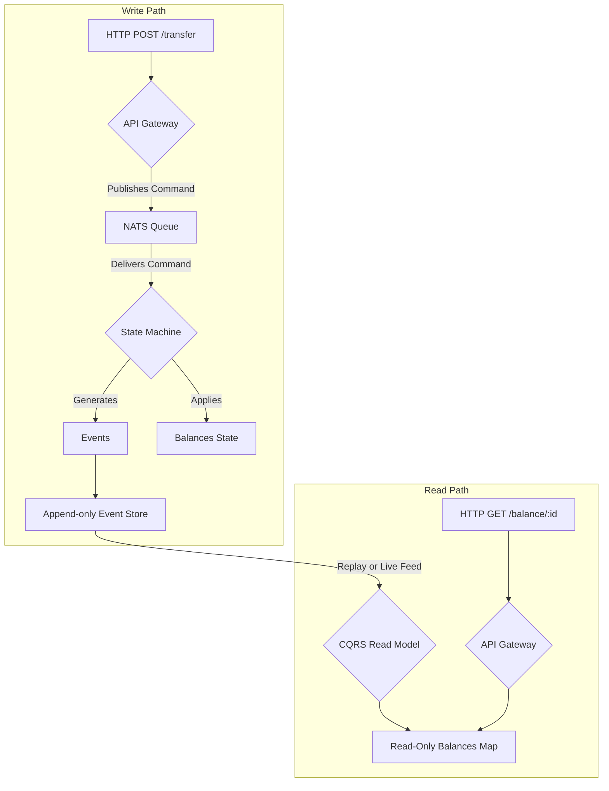

# [Epic] 使用 Go 實作數位錢包 Demo Lab

## 摘要 / Summary
本專案旨在根據《Digital Wallet》設計章節，使用 Go 語言實作一個事件溯源（Event Sourcing）架構的數位錢包後端 Demo。核心目標是透過一個可運行的原型，實際驗證設計中的「高吞吐」、「資料正確性」與「可重現性」，並利用 Go 的 Goroutines 與 NATS 訊息佇列來高效模擬事件驅動的流水線架構。

## 背景與動機 / Context & Motivation
設計文檔中的架構理論需要一個實踐性的 POC (Proof of Concept) 來驗證其可行性與優勢。透過 Go 語言建立此 Demo Lab，可以：
1.  **驗證設計**：將抽象的系統設計（事件溯源、CQRS、確定性狀態機）轉化為具體的、可執行的程式碼。
2.  **性能測試**：實際測試在 Go 的併發模型下，此架構能達到的吞吐量與處理能力。
3.  **建立範例**：產出一份高品質的程式碼範例，展示如何用 Go 語言優雅地實現金融級別的高併發後端服務。

## 範圍 / Scope
* **包含 (In-Scope):**
    * **核心元件實作**:
        * 接入層 (API Gateway)：接收轉帳請求。
        * 訊息佇列 (Command Queue)：使用 **NATS**。
        * 核心引擎 (Deterministic State Machine)：單一 Goroutine 處理業務邏輯，生成事件。
        * 儲存層 (Event Store)：使用本地 Append-only 檔案儲存事件。
        * 查詢視圖 (Read-Only CQRS View)：提供餘額查詢。
    * **核心場景驗證**:
        * 場景一：使用 **k6** 進行高併發轉帳測試。
        * 場景二：餘額不足等業務驗證。
        * 場景三：事件回放與狀態重現。
        * 場景四：基於 `transaction_id` 的冪等性處理。
* **不含 (Out-of-Scope):**
    * **分散式協調**：Saga Coordinator 與跨分片 (Cross-Partition) 轉帳邏輯。
    * **共識演算法**：整合 Raft 實現高可用叢集。
    * **生產級部署**：日誌、監控、警報、容器化等。

## 核心需求與規格 / Core Requirements & Specifications
### 1. 接入層：API Gateway & ID Generator
*   **功能**: 接收 HTTP 轉帳請求，並為每個請求生成唯一 ID。
*   **API Endpoint**: `POST /v1/wallet/transfer`
*   **實作**: 使用 `Gin` 框架。使用 `google/uuidv7` 生成 `transaction_id` 以確保冪等性。

### 2. 訊息佇列：Command Queue
*   **功能**: 序列化傳入的轉帳請求，將隨機的外部請求轉為有序的內部命令流。
*   **實作**: 使用 **NATS** 作為輕量級訊息佇列。API Gateway 將轉帳命令發布到一個 NATS 主題 (Subject)，核心引擎則訂閱該主題。

### 3. 核心引擎：Deterministic State Machine
*   **功能**: 系統核心，以單一執行緒（Goroutine）模式運行，保證處理的確定性。負責驗證命令、執行業務邏輯並生成事件。
*   **實作**:
    *   建立 `WalletEngine` struct，啟動一個獨立的 Goroutine，循環從 **NATS** 訂閱中讀取命令。
    *   內部維護一個 `map[string]int64` 作為帳戶餘額的當前狀態 (Current State)。
    *   實作 `Execute(command) -> []Event` 函數。此函數 **不** 直接修改餘額，而是根據邏輯生成 `MoneyDeducted`, `MoneyCredited`, `TransactionFailed` 等事件。
    *   狀態的變更是透過 `Apply(event)` 函數完成，`WalletEngine` 在生成事件後，呼叫此函數來更新自己的記憶體狀態。

### 4. 儲存層：Event Store
*   **功能**: 以僅追加 (Append-only) 的方式持久化儲存狀態機生成的所有事件，作為系統的唯一真相來源。
*   **實作**:
    *   使用本地檔案（例如 `events.log`）作為事件儲存。
    *   每個事件被序列化為 JSON 格式（每行一個 JSON 物件），並追加寫入檔案末尾。

### 5. 查詢視圖：Read-Only State Machine (CQRS)
*   **功能**: 提供快速的餘額查詢，與寫入路徑分離。
*   **實作**:
    *   啟動一個獨立的 Goroutine，它訂閱 `WalletEngine` 生成的事件流（可透過 NATS 的 Fan-out 或直接從 Engine 傳遞）。
    *   維護一個專門用於查詢的 `map[string]int64`。
    *   提供一個 `GET /v1/wallet/balance/:account_id` API Endpoint，從這個 Read-Only Map 中讀取餘額並返回。

### 6. 資料模型 / Payload 定義
```go
// TransferCommand 代表從 API 傳入、進入佇列的命令
type TransferCommand struct {
    TransactionID string `json:"transaction_id"`
    FromAccount   string `json:"from_account"`
    ToAccount     string `json:"to_account"`
    Amount        int64  `json:"amount"` // 使用 int64 處理分 (cents)
}

// Event 是描述狀態變化的基礎介面
type Event interface {
    GetType() string
}

// MoneyDeducted 扣款成功事件
type MoneyDeducted struct {
    TransactionID string `json:"transaction_id"`
    Account       string `json:"account"`
    Amount        int64  `json:"amount"`
}

// MoneyCredited 入帳成功事件
type MoneyCredited struct {
    TransactionID string `json:"transaction_id"`
    Account       string `json:"account"`
    Amount        int64  `json:"amount"`
}

// TransactionFailed 交易失敗事件 (例如: 餘額不足)
type TransactionFailed struct {
    TransactionID string `json:"transaction_id"`
    FromAccount   string `json:"from_account"`
    Reason        string `json:"reason"`
}
```

## 流程圖 / Workflow Diagram (Optional)


## 驗收標準 / Acceptance Criteria (AC)

- [ ] **AC 1: 高併發轉帳測試**：使用 **k6** 腳本模擬高併發場景（例如：100 個虛擬用戶持續 1 分鐘），對 `POST /v1/wallet/transfer` 端點發起請求。測試結束後，透過查詢接口或後端驗證，所有帳戶的總金額必須與測試前保持不變。
- [ ] **AC 2: 業務驗證測試**：建立一個自動化測試案例，讓一個初始餘額為 100 的帳戶，連續發起 10 筆金額為 20 的轉帳。系統必須正確生成 5 個 `MoneyDeducted` 事件和 5 個 `TransactionFailed` 事件，且該帳戶最終餘額應為 0，絕不能為負數。
- [ ] **AC 3: 可重現性測試**：建立一個自動化測試，在執行一系列轉帳操作後：(1) 記錄下當前的記憶體餘額狀態。(2) 關閉並重啟服務，清空 `WalletEngine` 的記憶體狀態。(3) 服務啟動時，從 `events.log` 檔案中讀取所有事件，並依次應用於空的 `WalletEngine`。(4) 驗證重播後的餘額狀態與步驟 (1) 中記錄的狀態完全一致。
- [ ] **AC 4: 冪等性測試**：建立一個自動化測試，使用相同的 `transaction_id` 連續發送兩次轉帳命令。系統必須只處理第一次請求，只生成一組扣款與入帳事件，第二次請求應被忽略或直接返回成功。

## 技術筆記與限制 / Technical Notes & Constraints (Optional)

*   **技術棧建議**:
    *   Web 框架: `gin-gonic/gin`
    *   UUID: `google/uuidv7`
    *   訊息佇列: `nats-io/nats.go`
    *   序列化: 標準庫 `encoding/json`
    *   負載測試: `k6`
*   **核心架構**: 確定性狀態機必須在一個獨立的、專屬的 Goroutine 中運行，這是保證資料一致性與正確性的關鍵，避免使用任何鎖（Mutex）。
*   **儲存層**: Event Store 初期採用本地檔案，是為了最大化循序寫入效能。生產環境可評估替換為專用事件資料庫（如 EventStoreDB）或使用 PostgreSQL 的僅追加表。
*   **資料精度**: 金額統一使用 `int64` 類型來表示最小貨幣單位（如：分），以完全避免浮點數精度問題。
