# 系統設計讀書會｜Ch.13 Stock Exchange — 電子股票交易所設計

> 本文根據《System Design Interview Vol.2》第 13 章整理，適合讀書會分享與技術 Blog 閱讀。

---

## 前言

交易所的核心任務自古不變： **撮合買家與賣家** 。從早期人工喊價，到今日完全電子化，技術演進大幅提升了交易量。NYSE（紐約證券交易所）每日撮合數十億筆，HKEX（香港交易所）每日交易量高達 2,000 億股。這類系統對**延遲（Latency）、吞吐量（Throughput）、可靠性（Availability）**的要求極為嚴苛。

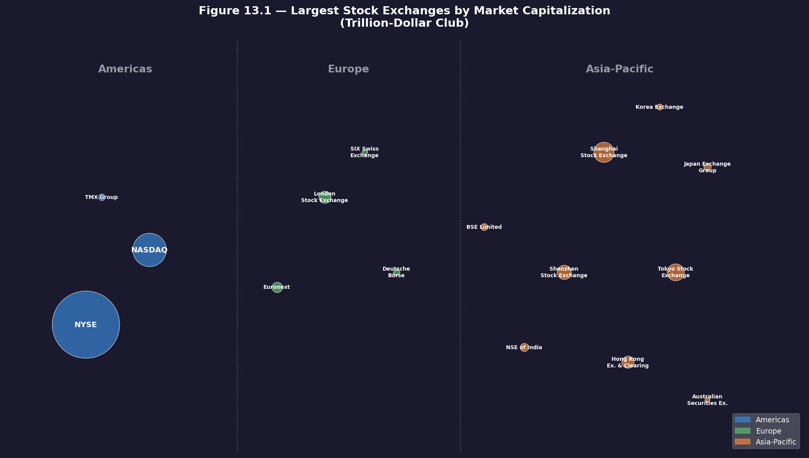
泡泡大小 對應市值規模市場規模。例如，紐約證券交易所 (NYSE) 每日處理數十億次撮合，而香港交易所 (HKEX) 每日處理約 2000 億股的交易。
顏色分區：藍色 = Americas、綠色 = Europe、橙色 = Asia-Pacific

| 區域                | 主要交易所                                                                                                                                                               |
| ------------------- | ------------------------------------------------------------------------------------------------------------------------------------------------------------------------ |
| 美洲 (Americas)     | NYSE (規模最大)、NASDAQ、TMX Group                                                                                                                                       |
| 歐洲 (Europe)       | Euronext、London Stock Exchange (LSE)、Deutsche Börse、SIX Swiss Exchange                                                                                               |
| 亞太 (Asia-Pacific) | Shanghai Stock Exchange、Japan Exchange Group、Tokyo Stock Exchange、Shenzhen Stock Exchange、HKEX、NSE of India、BSE Limited、Korea Exchange、Australian Securities Ex. |

---

## 專有名詞速查表

| **名詞**                     | **說明**                                           |
| ---------------------------------- | -------------------------------------------------------- |
| **Broker（券商）**           | 零售客戶的中介（如 Robinhood），提供介面下單與查看行情。 |
| **Institutional Client**     | 法人投資人（如對沖基金），需要超低延遲的專業軟體。       |
| **Limit Order（限價單）**    | 指定價格的委託，不一定立即成交。                         |
| **Market Order（市價單）**   | 不指定價格，以當前最佳市場價格立即成交。                 |
| **Order Book（委託簿）**     | 所有掛單列表，分買方（Bid）與賣方（Ask）。               |
| **Spread（價差）**           | Ask Price − Bid Price，越小代表市場流動性越好。         |
| **Execution / Fill（成交）** | 撮合成功後的結果，一次撮合產生兩筆成交記錄（買賣雙方）。 |
| **Market Making（造市）**    | 持續掛出買賣報價以賺取價差，提供市場流動性。             |
| **FIX Protocol**             | 金融業標準的訊息交換協議。                               |
| **SBE**                      | Simple Binary Encoding，極高效的二進位編碼格式。         |
| **Sequencer（序列器）**      | 為訂單加上嚴格遞增序列號，確保處理順序的確定性。         |
| **Matching Engine**          | 系統核心，負責維護委託簿與執行撮合邏輯。                 |
| **Event Sourcing**           | 儲存所有狀態變更的事件序列，而非僅存最終狀態。           |
| **mmap**                     | 將檔案映射到記憶體，實現極低延遲的共享記憶體通訊。       |
| **Ring Buffer**              | 固定大小、Lock-free 的循環佇列，避免動態記憶體分配。     |

** Market Data（市場數據）**
美國股市中三種不同層級的市場數據 (Market Data Levels)。這些數據層級決定了交易者能看到多少市場深度（Order Book Depth）。


### ## Level 1 (L1) 數據：最佳報價

這是最基礎的市場數據，通常提供給一般散戶投資者。

* **內容：** 僅顯示**最佳買入價 (Best Bid)**、**最佳賣出價 (Best Ask)** 以及對應的**數量 (Quantity)**。
* **術語解釋：**
  * **Bid (買價)：** 買家願意支付的**最高**價格。
  * **Ask (賣價)：** 賣家願意接受的**最低**價格。
* **範例 (Figure 13.2)：** 蘋果股票的最佳賣價為 100.10，最佳買價為 100.08。這兩者之間的差額稱為 **Spread (價差)**。

---

### ## Level 2 (L2) 數據：市場深度

L2 提供了比 L1 更多的價格層次，讓我們能看到「排隊中」的訂單。

* **內容：** 除了最佳報價外，還顯示了多個價格檔位的買賣委託量。
* **重要性：** 交易者可以透過 L2 觀察**買賣盤的厚度 (Depth of Market)**。如果賣盤 (Sell Book) 在某個價位有大量委託，該價位可能成為阻力區。
* **範例 (Figure 13.3)：** 可以看到除了 100.10 之外，還有 100.11、100.12 等更高價位的賣單在排隊。

---

### ## Level 3 (L3) 數據：完整訂單明細

L3 是最高層級的數據，通常僅提供給註冊的市場參與者或專業交易機構（如造市商）。

* **內容：** 它不僅顯示每個價格檔位的總量，還進一步拆解出該價格檔位內**每一筆獨立訂單**的具體數量。
* **技術特點：** 在系統設計中，L3 數據對應的是**訂單簿 (Order Book)** 的完整狀態。
* **範例 (Figure 13.4)：** 在最佳賣價 100.10 這一檔，我們可以看到總量 1800 股是由四筆分別為 200、400、1100、100 股的獨立訂單組成的。

---

### ### 三種層級數據總結表

| 層級         | 顯示資訊             | 主要使用者         | 系統複雜度            |
| :----------- | :------------------- | :----------------- | :-------------------- |
| **L1** | 僅限 Best Bid/Ask    | 一般大眾、散戶     | 低 (數據量最小)       |
| **L2** | 多個價格檔位的總量   | 專業交易者、當沖客 | 中 (需要聚合訂單)     |
| **L3** | 每一筆獨立委託單明細 | 造市商、機構投資者 | 高 (需要處理所有事件) |

這部分是設計**市場數據廣播服務 (Market Data Service)** 的關鍵。若要處理 L3 數據，系統必須具備極高的吞吐量，因為任何一筆訂單的進入、取消或成交，都會觸發數據更新。

# Candle stick

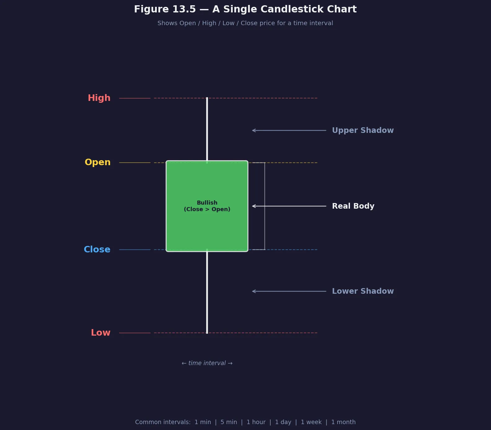

---

## Step 1 — 釐清需求與規模

### 功能性需求

* **交易品種** ：僅支援股票。
* **訂單操作** ：新增委託（Place）、取消委託（Cancel）。
* **訂單類型** ：限價單（Limit Order）。
* **規模** ：同時在線數萬人、每日交易量數十億筆。
* **風控** ：檢查單日交易上限。
* **錢包管理** ：下單前確認餘額並凍結資金。
* **定序器 (Sequencer)**： 確保所有進來的訂單都有唯一的序列號，以保證公平性與確定性。

### 非功能性需求

* **可用性** ：交易所不能當機，必須設計主從備援機制，確保狀態能在毫秒內切換。至少 99.99%（4 nines）。
* **容錯性** ：需有快速故障偵測與恢復機制。
* **延遲** ：Round-trip 需達毫秒等級，關注 P99 延遲。
  * **精確定義**：延遲的計算起點是市價單進入交易所（enters the exchange）那一刻，終點是該訂單作為已完成的執行結果回傳（returns as a filled execution）。此定義用於實務基準測試（Benchmarking），確保量測範圍不含網路傳輸至券商的部分。
  * 撮合引擎 (Matching Engine)： 如何在記憶體中以微秒 (microsecond) 級別的速度完成買賣訂單的優先級排序與媒合。
* **安全性** ：KYC 驗證與 DDoS 防護。
* **數據一致性**： 交易記錄必須絕對準確且不可竄改。

### 規模估算

* **交易時段** ：6.5 小時 = 23,400 秒。
* **每日委託** ：10 億筆。
* **平均 QPS** ：約  **43,000 QPS** 。43,000 QPS 是假設這 10 億筆訂單在 6.5 小時內「均勻分佈」在每一秒的結果。
* **峰值 QPS** ：約  **215,000 QPS** 。使用了 **5 倍 (5x)** 作為估算基準（**$43,000 \times 5 = 215,000$**）。**開盤前 15 分鐘**與**收盤前 15 分鐘**通常會消耗掉當日交易量的 30-50%。當重大新聞發生或某檔股票觸發熔斷時，流量會瞬間暴漲。

---

## Step 2 — 高階設計


為了方便理解，我們可以將整個流程拆解為三個核心流動路徑：交易路徑（Trading Path）、市場數據流（Market Data Flow） 與 報表流（Reporting Flow）。

### 三條主要資料流

1. **Trading Flow（交易流）** ：關鍵路徑，需極低延遲。

* `Client` → `Broker` → `Gateway` → `Order Manager` → `Sequencer` → `Matching Engine`

這是系統中最重要、對延遲（Latency）最敏感的路徑，負責處理訂單的執行。

- Step 1-3 (下單與驗證)： 用戶透過券商（Broker）將訂單送往交易所。Client Gateway 負責身分驗證、限流與協議轉換。
- Step 4-6 (風險檢查與資金預扣)： Order Manager 收到訂單後，先送到 Aggregated Risk Check 檢查該用戶是否有足夠資金或持股，並在 Wallet 進行資金預扣（防止超買）。
- Step 7-8 (定序)： 這是系統的靈魂。Sequencer (定序器) 為每筆訂單打上唯一的序號，確保所有訂單是以進入的先後順序被處理，這保證了交易的公平性。
- Step 9-11 (媒合)： Matching Engine (撮合引擎) 在**記憶體**中維護 Order Book，根據價格與時間優先級進行媒合。媒合成功後，回傳執行結果。
- Step 12-14 (確認回傳)： 執行結果路經 Order Manager 回傳給 Gateway，最後通知券商與客戶訂單已成交或已委託。

2. **Market Data Flow（市場資料流）** ：

* `Matching Engine` → `Execution Stream` → `Market Data Publisher` → `Data Service` → `Broker`

交易所不僅要媒合，還要向全世界廣播當前的股價波動。

- M1-M2： 當撮合引擎產生成交紀錄或訂單更新時，會將數據傳給 Market Data Publisher。
- M3： Data Service 接收這些原始數據，將其轉換為我們常見的 K 線圖 (Candlestick chart) 或 L1/L2 深度圖，並推播給用戶端觀看。

3. **Reporting Flow（報告流）** ：用於對帳、稅務與法規，非關鍵路徑。
   這條路徑與交易執行是非同步（Asynchronous）的，不影響交易速度，但對合規與對帳至關重要。

- Reporter： 負責收集所有的訂單與執行明細（Executions）。
- DB： 將交易數據永久存儲在資料庫中。這些數據用於日後的清算（Settlement）、歷史查詢、法律報表以及稅務用途。

---

## Trading Flow 核心元件深度說明

### 1. Matching Engine（撮合引擎）

Matching Engine 又稱 **Cross Engine**，是交易所的核心，整條 critical path 上唯一真正「決定誰跟誰成交」的元件。

#### 三大職責

| 職責 | 說明 |
|------|------|
| **維護 Order Book** | 每個股票代碼各一本（如 AAPL、TSLA），記錄所有未成交掛單的價格與數量 |
| **執行撮合** | 買價 ≥ 賣價時立即配對，一次撮合產出兩筆 Execution（買方一筆、賣方一筆） |
| **產出市場數據流** | 將 Execution 串流送給 Market Data Publisher，重建 L1/L2/L3 資料 |

#### 撮合演算法：FIFO（Price-Time Priority）

書中給出的演算法是最常見的 **價格優先、時間優先（FIFO）**：

```
handleNew(orderBook, order):
  if BUY:
    match(orderBook.sellBook, order)   // 吃對手方賣單
  if SELL:
    match(orderBook.buyBook, order)    // 吃對手方買單

match(book, order):
  leavesQty = order.quantity
  iter = book.limitMap[order.price].orders  // 從最佳價位開始
  while iter.hasNext() && leavesQty > 0:
    matched = min(iter.next().quantity, leavesQty)
    leavesQty -= matched
    remove(iter)
    generateMatchedFill()              // 產出兩筆 Execution
```

**實例（PDF p.395，Figure 13.13）**：

```
賣盤（Ask Book）
  100.13 → 200
  100.12 → 600 + 900
  100.11 → 900 + 700 + 400
  100.10 → 200 + 400 + 1100 + 100  ← best ask

進來一張市價買單 2700 股：
  吃掉 100.10 全部：200 + 400 + 1100 + 100 = 1800
  吃掉 100.11 部分：900
  合計 2700，done。
  成交後 best ask 移動到 100.11，bid/ask spread 擴大。
```

取消訂單走 `handleCancel`：先查 `orderMap[orderId]` 定位節點，再從 PriceLevel 移除，並更新狀態為 `CANCELED`。

#### 關鍵特性：確定性（Determinism）

> *"Given a known sequence of orders as input, the matching engine must produce the same sequence of executions as output when the sequence is replayed."*

這是高可用（Hot-Warm 備援）與故障復原的基礎：

- **功能確定性**：相同順序的事件 → 永遠相同的撮合結果，與時間無關
- **延遲確定性**：每筆交易的延遲應盡量一致，99th percentile latency 是核心指標

為達到延遲確定性，Matching Engine 的 Application Loop 會被 **pin 到固定 CPU core**，避免 context switch 與 lock contention。

#### Matching Engine 不做什麼

| 不做 | 由誰負責 |
|------|----------|
| 驗證資金是否足夠 | Order Manager + Wallet |
| 給訂單排序編號 | Sequencer |
| 發布市場行情 | Market Data Publisher |
| 記錄交易歷史 | Reporter |

#### Matching Engine 的「組成」：兩種視角

Matching Engine、Order Book、Sequencer、Order Manager 的邊界，在書中**高階設計**與**Deep Dive** 是不同的，容易混淆。

**高階設計（各自獨立）**

```
Gateway → Order Manager → Sequencer → Matching Engine
                                            │
                                   內部維護 Order Book
```

- Order Manager、Sequencer 是**獨立元件（process）**
- Order Book 是 Matching Engine **內部的資料結構**，不獨立部署

**Deep Dive：Event Sourcing 設計（邊界重組）**

```
┌──────────────────────────────┐
│        Matching Engine        │
│  ┌────────────────────────┐  │
│  │  Order Manager (lib)   │  │  ← 變成嵌入式 library
│  │     Order State        │  │
│  └────────────────────────┘  │
│  ┌────────────────────────┐  │
│  │     Matching Core      │  │
│  └────────────────────────┘  │
│        App Loop               │
└──────────────────────────────┘
         ↕ mmap Event Store
      （Sequencer 功能被吸收進來）
```

- **Order Manager** 從獨立 process 變成嵌入在 Matching Engine 裡的 library，各元件各自維護一份 Order State 副本
- **Sequencer** 不再是獨立 process，其排序功能被 Event Store 的 sequence 欄位取代，只剩「蓋章寫入」這一件事

**整理對照**

| 名稱 | 性質 | 高階設計 | Deep Dive |
|------|------|----------|-----------|
| Matching Engine | 元件 | 獨立 process | 獨立 process（但更大） |
| Order Book | **資料結構** | ME 內部 | ME 內部（不變） |
| Sequencer | 元件 | 獨立 process | 功能簡化，融入 Event Store |
| Order Manager | 元件 | 獨立 process | 嵌入 ME 的 library |

### 2. Sequencer（序列器）

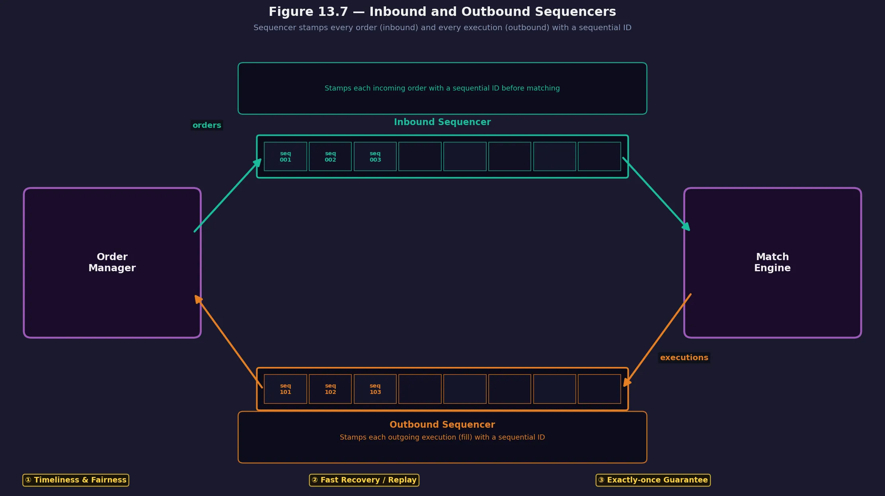
為了保證確定性 (Determinism)，交易所必須讓所有訂單「排好隊」。

* 雙向定序：

  - Inbound (入站)： 給每一筆進入 Matching Engine 的訂單打上序號。

  * Outbound (出站)： 給每一筆從 Matching Engine 出來的成交結果打上序號。。
* **作用** ：

  * **公平性**： 先到的訂單保證先被處理。
  * **快速復原 (Fast Recovery)**： 如果 Matching Engine 當機重啟，只要按順序重新「重放 (Replay)」定序器裡的事件，就能還原到正確的狀態。
  * **Exactly-once**： 確保每一筆交易只會被處理一次，不會重複。

### 3. Client Gateway

它是所有請求的第一站，設計重點在於極低的延遲。

* 核心功能︰
  * 認證 (Auth)： 確認客戶身分。
  * 驗證 (Validation)： 檢查訂單格式是否正確。
  * 限流 (Rate Limit)： 防止惡意程式或錯誤程式碼瞬間衝垮交易所。
  * 正規化 (Normalization)： 將不同來源的協議（如 FIX 協議）轉換為交易所內部的統一格式。
  * 
* **協議** ：零售走 HTTP/WebSocket；機構走 FIX 或 Binary 協議。

#### 三種 Client Gateway 類型（Figure 13.9）


| 類型                                  | 使用者           | 協議              | 延遲特性   |
| :------------------------------------ | :--------------- | :---------------- | :--------- |
| **App/Web Gateway**             | 一般散戶         | HTTP/WebSocket    | 毫秒可接受 |
| **API Gateway (FIX/Non-FIX)**   | Broker / Dealer  | FIX 或自訂 Binary | 低延遲     |
| **Colo Engine（機房共置引擎）** | 對沖基金、造市商 | 自定義 Binary     | 光速等級   |

**Colo Engine** 是終極低延遲方案：券商將伺服器實體放入交易所資料中心，延遲等於光走電纜的時間。這是合法的付費 VIP 服務。設計原則：Gateway 應**保持輕量（Stay Lightweight）**，複雜邏輯交給後端的 Matching Engine 與 Risk Check。

> **FIX 訊息格式範例**（金融業標準訊息，文字格式）：
>
> ```
> 8=FIX.4.2 | 9=176 | 35=8 | 49=PHLX | 56=PERS |
> 52=20071123-05:30:00.000 | 11=ATOMNOCCC9990900 | 20=3 | 150=E | 39=E
> | 55=MSFT | 167=CS | 54=1 | 38=15 | 40=2 | 44=15 | 58=PHLX EQUITY
> TESTING | 59=0 | 47=C | 32=0 | 31=0 | 151=15 | 14=0 | 6=0 | 10=128 |
> ```
>
> FIX 冗長且解析慢，Gateway 會將其轉換為 **SBE（Simple Binary Encoding）** 後才進入交易域。

### 4. Order manager

Order Manager 負責管理訂單的「生命週期」，是整條交易 critical path 上唯一同時接觸「進單」與「回執」兩端的元件。

#### 職責概覽

| 階段 | 動作 | 說明 |
|------|------|------|
| 下單時 | 風險檢查 | 呼叫 Aggregated Risk Check，確認用戶單日交易額未超過 $1M |
| 下單時 | **確認餘額** | 向 Wallet 查詢可用資金/持股是否足夠 |
| 下單時 | **圈存（資金預扣）** | 確認後立即凍結所需資金或股票，防止超買/超賣 |
| 下單時 | 轉交 Sequencer | 只傳必要欄位，減少傳輸量 |
| 成交後 | **實際扣款／交割** | 收到 Matching Engine 回傳的 Execution 後，觸發 Wallet 正式扣款並轉帳 |
| 撤單時 | **解凍圈存** | 撤單成功後釋放先前凍結的資金 |
| 全程 | 狀態轉換 | 維護訂單從 `New → PartiallyFilled → Filled / Canceled` 的完整狀態機 |

#### 圈存、扣款、確認餘額的分工

這三件事在書中統一由 **Order Manager 協調，Wallet 執行**，但具體發生時間點不同：

```
下單流程                       成交/撤單流程
─────────────────────         ──────────────────────────
Gateway → Order Manager       Matching Engine → Sequencer
             │                                    │
   ① 確認餘額（查詢 Wallet）              ③ 收到 Execution
   ② 圈存（凍結 Wallet）                 ④ 實際扣款/轉帳（Wallet）
             │                           ─── 或 ───
         Sequencer →                     收到 Cancel
         Matching Engine                 ⑤ 解凍圈存（Wallet）
```

- **確認餘額**（步驟①）：Order Manager 向 Wallet 發送查詢請求，確認可用餘額 ≥ 所需金額。買單看現金，賣單看持股數量。
- **圈存**（步驟②）：確認後立刻鎖定資金（從「可用」移至「凍結」），這個動作必須在送進 Sequencer 之前完成，否則同一筆資金可能被兩張訂單同時使用。
- **實際扣款**（步驟④）：撮合完成後，Order Manager 收到 fill 回執，觸發 Wallet 將凍結金額正式轉移給對手方，同時入帳買到的股票。
- **解凍**（步驟⑤）：撤單成功時，Wallet 將凍結金額釋放回可用餘額。

> 書中指出 Wallet 的設計細節在 **Chapter 12 Digital Wallet（p.341）** 中，可以直接套用到交易所場景。

#### 狀態複雜度是核心挑戰

書中直接點名：

> *"The challenge of managing the various state transitions is the major source of complexity for the order manager. There can be tens of thousands of cases involved in a real exchange system."*

部分成交（Partial Fill）讓狀態機特別複雜——同一張訂單可能被多個小訂單分批撮合，每次撮合都要更新 `filledQuantity`、`remainingQuantity`，並判斷是否繼續掛單。對應的 Wallet 操作也要分批執行（每次 fill 扣一部分款）。

#### 技術關鍵：Event Sourcing

內文提到 Event Sourcing (事件溯源) 是設計 Order Manager 的最佳實踐，原因正是狀態變化複雜：

- 傳統做法只存「當前狀態」，出問題時無法追溯是哪步圈存或扣款出錯。
- Event Sourcing 改為記錄所有事件（`NewOrderEvent`、`OrderFilledEvent`、`OrderCanceledEvent`），狀態可以隨時從頭 replay 重建，也方便審計與合規。

> 在 Deep Dive 的 Event Sourcing 設計中（p.402），Order Manager 進一步演化為**嵌入式 Library**：各元件（Matching Engine、Reporter）各自持有一份 Order State 副本，透過訂閱 Event Store 保持同步，避免跨 process 查詢拖慢 latency。

---

## 市場數據發布者 (Market Data Publisher, MDP) 說明

如果說「撮合引擎」是交易所的心臟，那麼 MDP 就是交易所的「廣播電台」。它負責將內部的撮合結果轉換成投資者能看懂的市場資訊。

## 市場數據流 (Market Data Flow) 的運作邏輯

當交易發生時，數據會依照以下流程流動：

1. 接收原始數據： MDP 從撮合引擎 (Matching Engine) 接收原始的成交紀錄（Executions）和訂單更新。
2. 構建訂單簿 (Build Order Books)： MDP 會根據這些連續的交易流，重建並維護每個股票代碼（如 AAPL, TSLA）的訂單簿快照。
3. 生成 K 線圖 (Generate Candlestick Charts)： 它會將成交價格與時間聚合，產出不同時長（如 1 分鐘、1 小時、1 天）的 K 線數據。

   - 持久化 (Persistence)： 為了確保數據不遺失，MDP 會將這些處理後的市場數據存儲起來。
4. 分發資訊 (Data Service)： 最後將數據傳送給 Data Service，讓訂閱者（如券商、財經網站、個人交易者）可以看到即時股價。

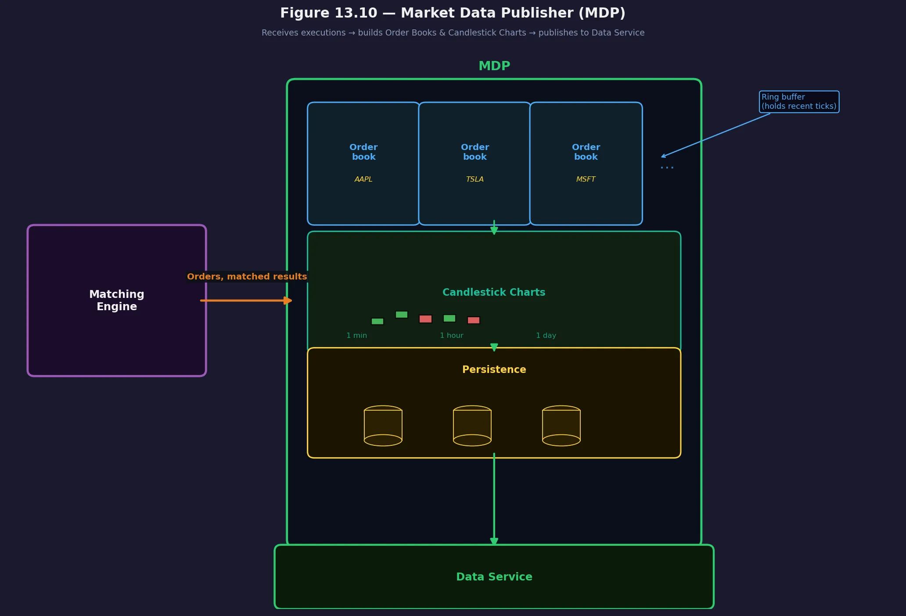

---

## Reporting Flow

報表流 (Reporting Flow)， 交易所系統中最後一個、也是與「錢」和「法規」最息息相關的部分。

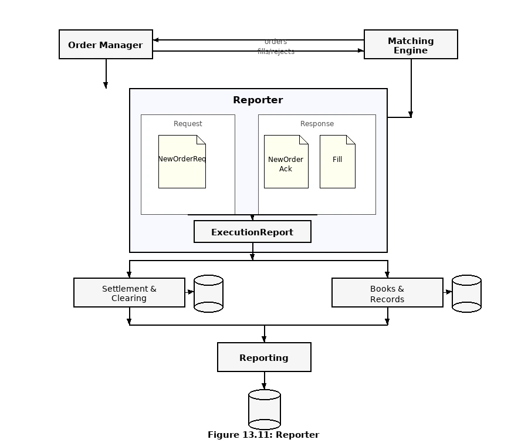

從架構圖中我們可以看到資料如何一步步變成正式記錄：

- 資料源： Order Manager 提供原始請求資料，Matching Engine 提供成交結果。
- Reporter (大腦)：

  - 它接收 NewOrderReq (請求)。
  - 它接收 NewOrderAck (確認) 和 Fill (成交)。
  - 將兩者合併，產出格式統一的 Execution Report。
- 後續處理分支：

  - Settlement & Clearing (結算與清算)： 負責實際的「錢貨兩訖」，並存入資料庫。
  - Books & Records (帳簿與紀錄)： 這是交易所的正式帳本，具有法律效力，同樣需要持久化存儲。
- 最終產出： 匯總到 Reporting 模組，生成最終提供給監管機構或客戶的報表。

### Reporter

Reporter 負責將碎片化的數據合併，產出具備商業與法規價值的資訊：

- 屬性合併 (Attribute Merging)： 原始的成交回報（Execution）通常只包含訂單 ID、價格和數量，而 Reporter 必須將其與最初的訂單請求（NewOrderReq）中的詳細資訊（如客戶名稱、帳戶類別等）結合，生成完整的 Execution Report (執行報告)。
- 主要用途：

  - 交易歷史 (Trading History)： 供客戶查詢。
  - 稅務報告 (Tax Reporting)： 計算買賣稅賦。
  - 合規檢查 (Compliance)： 確保交易符合當地法律。
  - 結算與清算 (Settlement & Clearing)： 處理實際的金錢撥付。

### 設計權衡：準確性 vs. 延遲

書中的一段話非常關鍵：

> "Efficiency and latency are critical for the trading flow, but the reporter is less sensitive to latency. Accuracy and compliance are key factors for the reporter."

設計交易所時的一個重要原則：職責分離 (Separation of Concerns)。

- 交易路徑： 追求極致的 Speed (速度)。
- 報表路徑： 追求極致的 Consistency (一致性) 與 Reliability (可靠性)。

在 圖 13.11 中，你會發現有多個不同的資料庫符號。這是為了避免「資源競爭」。
如果報表查詢（例如查半年前的紀錄）影響到正在進行的撮合速度，那是絕對不允許的。因此，交易所通常會將這些數據異步（Asynchronous）地推送到專門的報表資料庫。

### 即時市場數據的儲存技術：KDB / 列式資料庫

交易日中，市場數據（成交紀錄、Order Book 快照、K 線等）的寫入與查詢頻率極高，無法使用傳統 RDBMS。金融業的標準做法是：

**盤中（Intraday）：In-memory Columnar Database**

以 **KDB+**（由 Kx Systems 開發）為代表的**記憶體內列式資料庫（In-memory columnar database）**，是交易所與對沖基金最廣泛採用的即時市場數據儲存方案。

| 特性                                      | 說明                                                                                       |
| :---------------------------------------- | :----------------------------------------------------------------------------------------- |
| **列式儲存（Columnar）**            | 同一欄位的數據在記憶體中連續排列，時間序列聚合（如計算某時段最高價）效率極高               |
| **全記憶體操作**                    | 盤中數據完全存在記憶體，讀寫延遲達微秒等級                                                 |
| **時間序列原生支援**                | 內建針對金融時序數據（OHLCV）的查詢語法（Q/kdb+ 語言）                                     |
| **即時分析（Real-time analytics）** | Market Data Publisher 可直接寫入 KDB，量化策略可即時查詢當前 Order Book 深度或計算移動平均 |

**收盤後（End-of-Day）：持久化至歷史資料庫**

收盤後，KDB 中的盤中數據才會批次（Batch）寫入傳統歷史資料庫（如列式儲存 Parquet / ClickHouse，或專門的時序資料庫）。這種「盤中記憶體、收盤落地」的設計，是在**寫入性能**與**長期儲存成本**之間的最佳平衡。

---

## API 設計：外部與內部的橋樑

交易所主要透過 RESTful API 與外部（如券商）溝通，但對延遲極度敏感的機構則會選用更底層的通訊協定。

#### **核心端點 (Endpoints)**

**下單 (POST `/v1/order`)**

| 欄位          | 型別   | 說明                    |
| :------------ | :----- | :---------------------- |
| `symbol`    | string | 股票代碼，如 `AAPL`   |
| `side`      | string | `BUY` 或 `SELL`     |
| `price`     | long   | 價格（以 cents 為單位） |
| `orderType` | string | 本設計僅支援 `LIMIT`  |
| `quantity`  | long   | 委託數量（股數）        |

Response Body（成功 200）：

```json
{
  "orderId": "ord-00123",
  "status": "NEW",
  "filledQuantity": 0,
  "remainingQuantity": 100
}
```

| HTTP 狀態碼 | 情境                                          |
| :---------- | :-------------------------------------------- |
| 200         | 訂單成功送達並接受                            |
| 400         | 參數錯誤（如 price ≤ 0、不支援的 orderType） |
| 401         | 認證失敗                                      |
| 500         | 伺服器內部錯誤                                |

**查詢成交 (GET `/v1/execution?orderId={id}`)**

Response Body（成功 200）包含 `filledQuantity`、`remainingQuantity`、`avgPrice` 等欄位，狀態碼同上表。

**市場數據 (GET `/v1/marketdata/...`)**

- `/orderBook/L2?symbol=AAPL&depth=10`：獲取 L2 訂單簿深度，`depth` 決定顯示幾個價格檔位。
- `/candles?symbol=AAPL&resolution=1m`：獲取用於繪製 K 線圖的歷史價格數據，`resolution` 可為 `1m`、`1h`、`1d`。

---

### ## 2. 資料模型：實體關係圖

雖然這不是最終的資料庫 Schema，但它定義了三個最重要的業務實體及其關係：

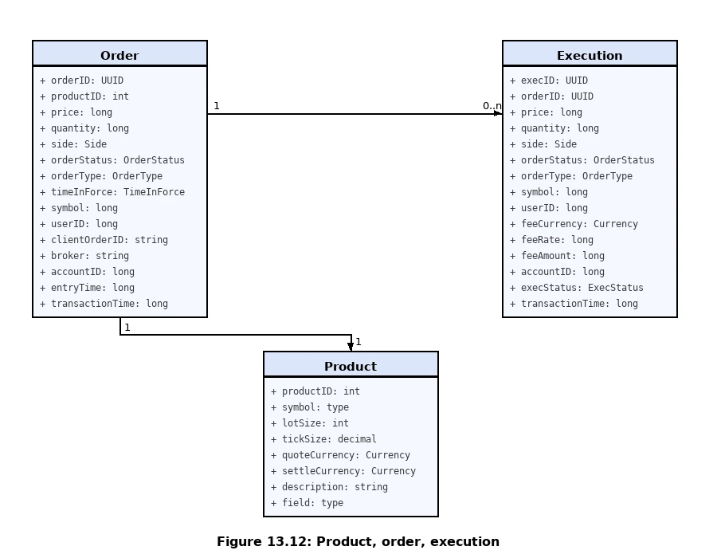

| 實體 (Entity)              | 描述                           | 關鍵屬性                                       |
| :------------------------- | :----------------------------- | :--------------------------------------------- |
| **Product (產品)**   | 被交易的標的物。               | 股票代碼、最小跳動價位 (Tick Size)、結算貨幣。 |
| **Order (訂單)**     | 客戶輸入的交易指令。           | 訂單 ID、用戶 ID、價格、原始數量、狀態。       |
| **Execution (執行)** | 撮合成功後的產出（成交回報）。 | 執行 ID、關聯訂單 ID、成交價、成交量、手續費。 |

**關係邏輯：**

* 一個 **Order** 對應一個 **Product**。
* 一個 **Order** 可以對應 **0 到多個 (0..n) Execution**。例如一筆 1000 股的大單可能被拆成三筆 200、300、500 股分別成交。

---

### ## 3. 性能優化的存儲策略

圖片中強調了一個非常關鍵的系統設計概念：**數據在不同路徑下的形態是不同的**。

1. **關鍵路徑 (Critical Path)：**
   * **不存資料庫：** 為了極高性能，訂單與成交在記憶體中執行。
   * **持久化：** 利用定序器 (Sequencer) 將資料寫入硬碟或共享記憶體，僅用於故障復原（Fast Recovery）。
2. **報表路徑 (Reporting Path)：**
   * **寫入資料庫：** 由 Reporter 非同步地將數據寫入傳統資料庫，供對帳、稅務與法規查詢使用。

---

### ### 💡 知識亮點：為什麼 Order 與 Execution 要分開？

這是一個典型的財務系統設計模式。**Order 描述的是「意圖」 (Intent)**，而 **Execution 描述的是「事實」 (Fact)**。在交易所中，意圖一旦發出可能被取消或部分完成，而事實一旦發生就不可更改。這種區分讓系統能準確追蹤每一股的去向。

---

## 資料模型與結構

### Order Book 實作

#### 訂單簿的設計需求

要支撐百萬級的交易，數據結構必須滿足以下嚴苛條件：

- 常數時間查詢 ($O(1)$)： 快速獲取某個價位的總成交量。
- 極速增刪改 ($O(1)$)： 下單、撤單、成交必須在瞬間完成。
- 快速獲取最佳報價： 隨時讀取最佳買價 (Best Bid) 與最佳賣價 (Best Ask)。
- 支持遍歷： 能夠順序瀏覽不同的價格層級。


為了達到 **O(1)** 的操作複雜度：

* **PriceLevel** ：使用雙向連結串列（DoublyLinkedList）儲存同一價位的訂單，保證 FIFO。
* **Book** ：使用 HashMap 映射價格到 `PriceLevel`。
* **OrderMap** ：輔助索引，透過 `OrderID` 快速定位訂單，達成 O(1) 取消。

| **操作**     | **做法**               | **複雜度** |
| ------------------ | ---------------------------- | ---------------- |
| **新增委託** | 在 PriceLevel 的 tail 插入   | O(1)             |
| **撮合成交** | 從 PriceLevel 的 head 移除   | O(1)             |
| **取消委託** | 透過 OrderMap 找到節點並移除 | O(1)             |


上圖以 Buy Book 為例，示範三種操作的實際執行流程：① 撮合時從 head 移除（price=100.08, qty=500）；② 新增時插入 tail（price=100.07, qty=200）；③ 取消時先以 OrderMap 定位節點，再從 PriceLevel 移除（price=100.06, qty=400）。

---

#### 資料結構選型比較：為什麼不是紅黑樹？


許多教科書與早期交易所實作使用 **Red-Black Tree（紅黑樹）** 維護價格層級。對通用場景而言這是合理選擇，但對追求微秒級延遲與 P99.99 一致性的現代交易所來說，**HashMap + DoublyLinkedList 通常更優**。

紅黑樹 red-black tree
兩棵樹（兩個獨立結構）。
尋找最佳價格的方向完全相反：
- **買盤（Bid Tree）**：買家願意支付的價格越高越有優勢。因此，系統在撮合時，需要頻繁對買盤這棵樹調用 `findMax()` 來尋找「最高買價（Best Bid）」
。
- **賣盤（Ask Tree）**：賣家願意賣出的價格越低越有優勢。因此，系統在撮合時，需要對賣盤這棵樹調用 `findMin()` 來尋找「最低賣價（Best Ask）」
。

**撮合邏輯的對立性**： 當一筆「新買單」進入系統時，它會先去掃描「對手的賣盤樹（Ask Tree）」，看看有沒有符合條件的最低賣價可以吃掉；如果賣盤樹裡沒有合適的對手，這筆買單才會被掛進「自己的買盤樹（Bid Tree）」中排隊等待。兩者互為對手，獨立維護狀態最為清晰。

```
class OrderBook {
    private Book<Buy> buyBook;   // 負責管理所有買單（Bid 樹/Map）
    private Book<Sell> sellBook; // 負責管理所有賣單（Ask 樹/Map）
    private PriceLevel bestBid;
    private PriceLevel bestOffer;
    // ...
}
```


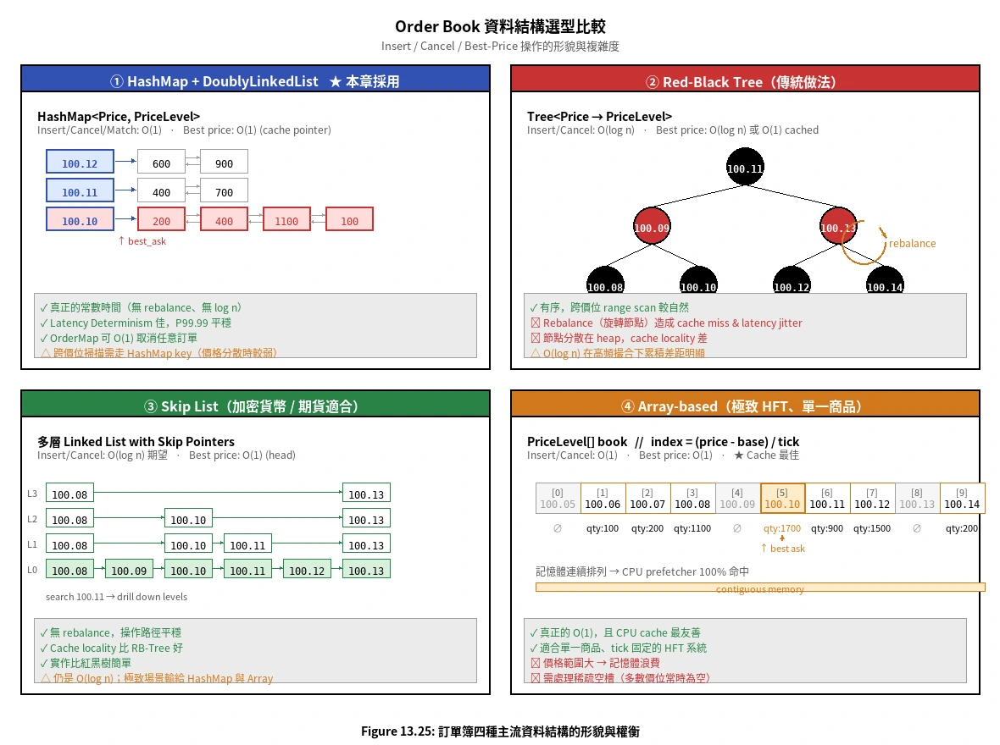
上圖以同一份價位資料對照四種資料結構的形貌：① HashMap + 雙向鏈表（本章採用，best_ask 直接由 cache pointer 指向）；② Red-Black Tree（紅黑相間的平衡樹，rebalance 旋轉造成 latency jitter）；③ Skip List（多層 linked list，搜尋時逐層 drill down，無 rebalance）；④ Array-based（價格直接索引，記憶體連續，CPU prefetch 最佳）。下表進一步對照四種主流方案：

| 資料結構                              | 新增/撤單 | 取 best price         | 跨價位掃描 | Cache 友善度     | 適用場景                                             |
| :------------------------------------ | :-------- | :-------------------- | :--------- | :--------------- | :--------------------------------------------------- |
| **HashMap + DoublyLinkedList**  | O(1)      | O(1)（維護指針）      | O(k)       | 中               | **股票**（價格集中、tick 固定）— 本章採用方案 |
| **Red-Black Tree**              | O(log n)  | O(log n) 或 O(1) 快取 | O(k log n) | 低（節點分散）   | 通用，但 rebalance 造成 latency jitter               |
| **Skip List**                   | O(log n)  | O(1)                  | O(k)       | 中               | 加密貨幣、期貨（價格分散、spread 寬）                |
| **Array-based（價格直接索引）** | O(1)      | O(1)                  | O(k)       | 高（連續記憶體） | 極致 HFT、單一商品、價格範圍可預期                   |

**為什麼 HashMap + List 勝過紅黑樹？**

1. **真正的 O(1)**：紅黑樹的 O(log n) 雖小，但不是常數；高頻撮合下累積差距明顯。
2. **Latency Determinism**：紅黑樹的 **rebalancing（旋轉節點）** 會造成不可預測的 cache miss 與分支預測失敗——這正是 P99.99 延遲的隱形殺手。HashMap + List 操作路徑平穩，無抖動。
3. **股票價格特性適配**：股票 tick size 固定、spread 通常只跨幾個 tick，HashMap 的「無序」缺點幾乎不影響——best price 變動時掃描下一個非空價位的成本接近常數。
4. **取消操作 O(1)**：透過 OrderMap 直接定位 Node 指針，無需在樹中重新搜尋。

---

#### Red-Black Tree 深入解析：為什麼平均很快、尾延遲很慢？

紅黑樹是 **自平衡二元搜尋樹（self-balancing BST）**，C++ `std::map`、Java `TreeMap` 內部都是它的實作，因此早期許多撮合引擎直接拿來當訂單簿 ── **上手最快**。但要理解它在交易所場景的代價，得從不變式（invariants）出發。

##### 五條不變式（Cormen《Introduction to Algorithms》）

1. 每個節點為紅或黑
2. **Root 必為黑**
3. 每個 NIL leaf 視為黑
4. **紅節點的子節點必為黑**（不能有兩個紅相鄰）
5. **從任一節點到其後代 NIL 的所有路徑，黑節點數量相同**（黑高度恆定）

性質 4、5 共同保證樹高最多為 $2 \log_2 n$，所有操作維持 O(log n)。

##### 為什麼選紅黑樹而不是 AVL Tree？

| 特性                           | AVL Tree            | Red-Black Tree                 |
| :----------------------------- | :------------------ | :----------------------------- |
| 平衡條件                       | 嚴格（高度差 ≤ 1） | 寬鬆（黑高度相同）             |
| 樹高                           | 較低                | 略高（最多 2 log n）           |
| Lookup                         | 略快                | 略慢                           |
| Insert/Delete 的 rotation 次數 | 多（嚴格平衡）      | **少（最多 2 次）**      |
| 適用場景                       | 讀多寫少            | **寫多** ── 訂單簿正是 |

訂單簿是「寫密集」場景（每筆下單都改 tree），紅黑樹的「寫操作便宜」是它勝過 AVL 的主因，也是它一度成為交易所首選的理由。

##### 訂單簿操作對應的 RB-Tree 操作

| Order Book 操作        | RB-Tree 操作             | 複雜度                        |
| :--------------------- | :----------------------- | :---------------------------- |
| 新增價位（PriceLevel） | Insert                   | O(log n) + 至多 2 次 rotation |
| 撤掉空價位             | Delete                   | O(log n) + 至多 3 次 rotation |
| 取 best ask            | findMin（最左節點）      | O(log n) 或 O(1) 維護指針     |
| 取 best bid            | findMax（最右節點）      | O(log n) 或 O(1) 維護指針     |
| Walk-the-book          | In-order traversal       | O(k)（k 個價位）              |
| Top-N price levels     | findMin + successor × N | O(log n + N)                  |

紅黑樹**唯一明顯勝過 HashMap 的場景**就是 in-order traversal 與 range scan ── 沿著 left/right spine 自然得到排序好的價位。HashMap 要做這件事，得另外維護 sorted set 或每次排序 keys。

##### Insert 觸發 Rebalance 的代價

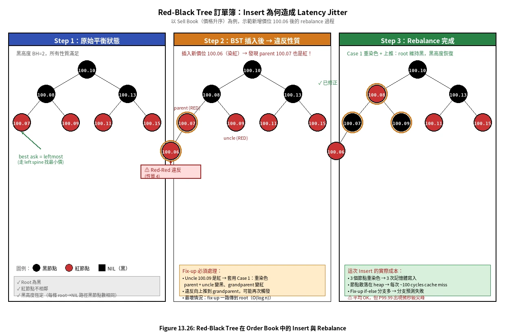

上圖以實際的 Sell Book 為例，示範新增一筆 100.06 的訂單時發生什麼事：

- **Step 1（左）**：原始平衡樹，黑高度 BH=2，所有性質滿足。
- **Step 2（中）**：BST 標準插入後，新節點 100.06 染紅，發現它的 parent 100.07 也是紅 ── **違反性質 4**。
- **Step 3（右）**：套用 Fix-up Case 1（uncle 是紅 → 重染色）：parent + uncle 變黑、grandparent 變紅，違反向上推到 grandparent，再檢查一次。

Fix-up 共有三種 case：

- **Case 1**：Uncle 是紅 → **重染色**（recolor），問題上推到祖父，可能再次觸發
- **Case 2**：Uncle 是黑、新節點為「內側」 → **一次旋轉**轉成 Case 3
- **Case 3**：Uncle 是黑、新節點為「外側」 → **一次旋轉 + 重染色**，結束

最壞情況下，Case 1 會沿著 root path 一路上推，伴隨 **O(log n) 次重染色**；Case 2/3 最多觸發 2 次 rotation。Delete 更糟，最多 3 次 rotation。

##### 為什麼 Rebalance 是 P99.99 殺手？

每次 rotation 涉及：

- **指針重連**：parent、left/right child、grandparent，至少 4 條指針更新
- **Cache miss**：節點散落在 heap 上，每跳一個節點約 100 cycles 的 L1/L2 miss
- **分支預測失敗**：fix-up 的 if-else 分支多，CPU pipeline 容易 stall
- **GC 壓力（Java）**：大量小物件 → minor GC 頻繁，撞上 STW 直接掉到毫秒等級

紅黑樹的 **average case 表現很好，但 worst case 的 fix-up 路徑會在 P99.99 上製造尖峰**。對訂單流入速率高度不均勻的交易所而言，這種尖峰常出現在最關鍵的時刻 ── 開盤、收盤、重大新聞 ── 也就是延遲最被放大檢視的時候。

##### 業界實作與遷移路徑

- **C++ `std::map<Price, OrderQueue>`**：紅黑樹實作，最容易上手，許多老牌系統的起點
- **Java `TreeMap`**：同樣是紅黑樹，受 GC 影響更明顯
- **Go**：標準庫無內建，常用 `github.com/emirpasic/gods/maps/treemap` 或自實作
- **遷移方向**：多數老牌交易所（NYSE、NASDAQ 早期）以紅黑樹為起點，後來逐步換成 HashMap + List（股票場景）或 Array-based（HFT 場景）；新建系統若不在乎極致延遲，**Skip List 是比紅黑樹更穩的選擇**（無 rebalance 旋轉、實作更簡單）

---

#### 歷史演進：從紅黑樹到現代委託簿的完整敘事

##### 1. 為什麼早期交易所（如早期 NYSE、NASDAQ）青睞紅黑樹？

早期電子化系統在設計委託簿時，紅黑樹幾乎是預設選擇，理由有兩個：

**寫多讀少的結構優勢**：委託簿是典型的「寫密集（Write-heavy）」場景，每筆新委託都可能新增或刪除一個價位節點，改變樹的結構。相較於要求嚴格平衡的 AVL Tree（任意節點高度差不超過 1），紅黑樹的平衡條件較寬鬆（只要求從任一節點出發的路徑黑高度相同）。這使得新增時最多旋轉 2 次、刪除時最多旋轉 3 次，寫入效能明顯優於 AVL Tree。

**開箱即用**：C++ `std::map`、Java `TreeMap` 底層就是紅黑樹的成熟實作。開發者無需自行維護平衡邏輯，直接取得有序的價位遍歷，上手成本最低。在 1990 年代電子化初期，這兩點就足以讓紅黑樹成為主流選擇。

##### 2. Rebalance 在微觀硬體層面的「災難性代價」

演算法課本告訴我們 Fix-up 是 O(log n)，但這個複雜度在追求微秒甚至奈秒的高頻場景中，轉譯成四個真實的硬體懲罰：

**指針重連成本（Pointer Rewiring）**：每次旋轉至少需要更新 4 條指針（父節點、左右子節點、祖父節點）。這些不是原子操作，每一步都是記憶體寫入。

**嚴重的 Cache Miss**：紅黑樹節點散落在 Heap 上，各自分配，地址不連續。Fix-up 沿樹向上跳躍時，每跳一個節點大約造成 100 個 CPU Cycle 的 L1/L2 Cache Miss。在開盤瞬間的高峰流量下，這個代價反覆累積。

**分支預測失敗（Branch Misprediction）**：判斷目前應走 Case 1（uncle 為紅 → 重染色）、Case 2（uncle 為黑、內側 → 旋轉轉 Case 3）還是 Case 3（uncle 為黑、外側 → 旋轉 + 重染色），需要密集的 if-else 判斷。這使 CPU Pipeline 頻繁 Stall，Instruction-level Parallelism 幾乎無從發揮。

**GC 壓力（Java 場景）**：若系統以 Java 撰寫（如使用 `TreeMap`），頻繁新增/刪除樹節點會產生大量短命小物件，觸發頻繁的 Minor GC。一旦遭遇 Stop-the-World（STW），延遲從微秒暴增到毫秒，而 STW 偏偏最容易在訂單爆量時被觸發。

這四個效應疊加，造成的不是「平均延遲略高」，而是 **延遲決定性（Latency Determinism）的喪失**：平均表現可能不差，但 P99.99 延遲的尖峰無法預測，且這些尖峰偏偏集中在開盤、收盤、重大新聞等系統壓力最高、延遲最被放大檢視的時刻。

##### 3. 「Walk-the-book」的存廢與各市場的演進路徑

中序遍歷（In-order traversal）是紅黑樹唯一對 HashMap 保有的結構優勢：沿著 left/right spine 自然得到排序好的價位，不需要額外的排序動作。不同市場對「walk-the-book」的依賴程度，決定了各自的演進方向：

**股票市場 → HashMap + 雙向鏈結串列**

股票的 Tick Size 固定（如美股以 cents 為單位），買賣價差通常只跨幾個 Tick。系統在正常撮合時，幾乎不需要深度掃描整本委託簿。既然 walk-the-book 需求弱，就可以放棄有序結構，換取真正的 O(1) 操作與零 Rebalance 抖動。搭配 Cache Pointer 直接指向當前 best ask / best bid，取最佳報價也是 O(1)。

**加密貨幣 / 期貨市場 → Skip List**

加密貨幣的價格範圍極大、Tick 極細、Spread 極寬。造市商與量化策略需要頻繁做深度 Range Scan，有序結構的優勢無法捨棄。此時業界傾向以 **Skip List** 取代紅黑樹：同樣是 O(log n)，但沒有複雜的 Fix-up 旋轉，各層的鏈結節點相對集中，Cache Locality 優於散落 Heap 的樹節點，且實作遠比紅黑樹簡單。

**極致 HFT 場景 → Array-based（直接索引）**

當商品單一、價格範圍可預期時（如特定期貨合約），可直接以 `book[price_in_cents - base_price]` 索引陣列，連續記憶體對 CPU Prefetch 極度友善，所有操作均為嚴格 O(1)，且無任何指針追蹤的 Cache Miss 問題。代價是需要預先分配整個價格範圍的空間，價格範圍大時記憶體浪費嚴重。

**演進時間線小結**：

| 時代              | 主流選擇                      | 核心驅動力                               |
| :---------------- | :---------------------------- | :--------------------------------------- |
| 1990s 電子化初期  | Red-Black Tree（std::map）    | 開箱即用、有序遍歷、寫優於 AVL           |
| 2000s 高頻交易興起 | HashMap + List（股票場景）    | Rebalance 造成 P99.99 延遲尖峰，不可接受 |
| 2010s 加密貨幣 / 現代期貨 | Skip List              | 需要 Range Scan，但拒絕 Rebalance 抖動   |
| 現代極致 HFT      | Array-based（單商品場景）     | 連續記憶體、CPU Cache 最大化              |

這條演進路徑的根本邏輯是：**當「平均 O(log n) 夠快」不再是設計目標，而「P99.99 絕對不能抖」成為硬性約束時，Rebalance 就從「可接受的代價」變成「架構層面的禁忌」**，驅動交易所逐步拋棄紅黑樹。

**什麼時候紅黑樹/Skip List 比較合適？**

- **加密貨幣交易所**：價格範圍大、tick 細、spread 寬，需頻繁做 walk-the-book，有序結構的 range scan 較有優勢。
- **期貨、衍生品**：價格區間發散，HashMap 的稀疏問題會浮現。
- 此時建議用 **Skip List 取代紅黑樹**——實作更簡單、無 rebalance 抖動、cache locality 也較好。

**什麼時候 Array-based 最快？**

當價格範圍可預期（如美股以 cents 為單位）、tick size 固定，可用陣列直接索引：`book[price_in_cents - base]`。CME、Nasdaq 部分市場數據處理採此法，**連續記憶體對 CPU cache 極度友善**。代價是價格範圍大時記憶體浪費、需處理稀疏空槽。

> **小結**：本章選擇 HashMap + DoublyLinkedList 不是「夠用就好」，而是針對**股票市場特性 + 微秒級 latency determinism** 的最佳解。若做加密貨幣交易所，請優先考慮 Skip List；若做單一商品的極致 HFT，可評估 Array-based。

---

#### HashMap + DoublyLinkedList 深入解析：Cache Pointer 優化

##### 三層架構圖解

```
┌─────────────────────────────────────────────────────────────┐
│ Layer 3 │  bestPrice (int64)  ◄── cache pointer, 更新 O(1) │
├─────────────────────────────────────────────────────────────┤
│ Layer 1 │  priceMap: map[price → *bookLevel]   (HashMap)    │
│         │     ├── price 100.10 → bookLevel { vol, *List }  │
│         │     ├── price 100.11 → bookLevel { vol, *List }  │
│         │     └── price 100.12 → bookLevel { vol, *List }  │
├─────────────────────────────────────────────────────────────┤
│ Layer 2 │  *List per level（DoublyLinkedList，FIFO）         │
│         │     → [Order-A] ↔ [Order-B] ↔ [Order-C]         │
├─────────────────────────────────────────────────────────────┤
│ Index   │  OrderMap: map[orderID → *orderEntry]             │
│         │     → O(1) cancel，不需掃描委託簿                  │
└─────────────────────────────────────────────────────────────┘
```

**每一層的職責分工：**

| 層           | 結構                          | 職責                                              | 複雜度       |
| :----------- | :---------------------------- | :------------------------------------------------ | :----------- |
| Layer 3      | `int64 bestPrice`（cache）    | 當前最佳買/賣價，更新時 compare-and-swap           | O(1) read    |
| Layer 1      | `map[int64]*bookLevel`        | 從 **價格** 快速定位該價位的全部訂單              | O(1) lookup  |
| Layer 2      | `*list.List`（雙向鏈結串列）  | 維護同一價位訂單的 **FIFO 順序**，頭部撮合尾部掛單 | O(1) 頭/尾   |
| OrderMap     | `map[string]*orderEntry`      | 從 **訂單 ID** 直接定位 list.Element，O(1) 取消   | O(1) lookup  |

##### addOrder：O(1) Cache Compare-and-Swap

HashMap+List 對 `BestPrice` 的最大優勢來自一個直觀的觀察：

> 新訂單的價格只可能「比當前最佳更好」或「不如當前最佳」。
> 因此只需做一次比較，不需要掃描所有價位。

```go
// addOrder: O(1) — HashMap insert + single compare
func (b *Book) addOrder(order *domain.Order) {
    // O(1) HashMap insert or lookup
    level := b.priceMap[order.Price]       // get or create
    level.Orders.PushBack(order)           // O(1) list append (tail)

    // O(1) cache update: compare only, NEVER scan
    if !b.hasOrders {
        b.bestPrice = order.Price          // first order
    } else if b.Side == Buy && order.Price > b.bestPrice {
        b.bestPrice = order.Price          // new bid is higher → new best
    } else if b.Side == Sell && order.Price < b.bestPrice {
        b.bestPrice = order.Price          // new ask is lower → new best
    }
    // if price is worse → cache unchanged, cost = 0
}
```

相比之下，紅黑樹在 `addOrder` 後若要取得最佳價格，需要走 `Min()/Max()` 遍歷樹的脊柱（O(log n)）。

##### removeOrder：條件式 refreshBestPrice

這是 HashMap+List **最關鍵的設計決策**，也是 Naive 實作（如本書附範例）最常犯的錯誤：

```
❌ Naive：每次 remove 都呼叫 refreshBestPrice() → O(n) always
✅ 優化：只有「被刪除的 level 是 bestPrice level」時才 rescan
```

```go
// removeOrder: O(1) fast path, O(n) slow path only when needed
func (b *Book) removeOrder(entry *orderEntry) {
    level := entry.level
    level.Orders.Remove(entry.element)  // O(1) linked-list pointer op

    if level.Orders.Len() == 0 {
        delete(b.priceMap, level.Price) // O(1)

        // 只有移除了「bestPrice 那層」才需要重新掃描
        // 其他任何 level 的刪除：cache 無需改動
        if level.Price == b.bestPrice {
            b.refreshBestPrice()        // O(n) — 但此情況在股票市場少見
        }
    }
    // level 還有訂單殘留 → cache 完全不動，成本 = 0
}
```

**為什麼 O(n) rescan 在股票市場「少見」？**

股票的 Tick Size 固定（如美股以 cents 為單位），正常交易時 Spread 只跨幾個 Tick。當最佳 level 被消耗時，「下一個最佳」幾乎一定就在緊鄰的 price ± 1 tick 處。即便要 rescan，被掃描的元素只有寥寥幾個而非整本書。

##### Naive vs 優化 vs 紅黑樹：完整複雜度對比

| 操作                     | Naive HashMap（每次都 refresh） | **優化 HashMap（條件式 refresh）** | Red-Black Tree     |
| :----------------------- | :------------------------------ | :---------------------------------- | :----------------- |
| `AddOrder`               | O(1) insert + **O(n) refresh**  | **O(1)** compare-and-swap           | O(log n)           |
| `CancelOrder`（非最佳）  | O(1) remove + **O(n) refresh**  | **O(1)** — 不觸發 rescan            | O(log n)           |
| `CancelOrder`（最佳）    | O(1) remove + **O(n) refresh**  | O(1) + **O(n) rescan**（unavoidable）| O(log n)           |
| `BestPrice()`            | O(1) cached                     | **O(1)** cached                     | O(log n) traversal |
| `MatchOrder`（消耗最佳） | O(n) per consumed level         | O(n) per consumed level             | **O(log n)** each  |
| `GetL2Snapshot`          | O(n log n) sort                 | O(n log n) sort                     | **O(n)** inorder   |

##### Go 實作走讀：三個設計亮點

**① bookLevel 內嵌 list.List，價格存在 key 上**

```go
type bookLevel struct {
    Price       int64       // 冗餘存一份方便 refreshBestPrice 比較
    TotalVolume int64       // 聚合量，O(1) 回答「此價位還剩多少？」
    Orders      *list.List  // 雙向鏈結串列：tail append，head match
}
```

`TotalVolume` 的意義：L2 快照只需讀這個欄位，不用遍歷 Orders list。

**② orderEntry 持有 *list.Element 與 *bookLevel 指針**

```go
type orderEntry struct {
    order   *domain.Order
    element *list.Element  // ← list.Remove(element) 是 O(1) pointer op
    level   *bookLevel     // ← 直接取 level.Price，免 priceMap 二次查詢
}
```

如果 orderEntry 只存 orderID，cancel 時需要先查 priceMap 才能得到 level，多一次 O(1) hash lookup，但更重要的是語義上不夠清晰。

**③ 最佳價格 cache 更新的邊界情況**

```
CancelOrder 流程：
  1. OrderMap[id] → entry          O(1)
  2. level.Orders.Remove(element)  O(1)
  3. level.TotalVolume -= qty      O(1)
  4. if level empty:
       delete priceMap[level.Price] O(1)
       if level.Price == bestPrice:
           refreshBestPrice()      O(n)  ← 只有這條路徑才慢
  5. delete OrderMap[id]           O(1)

正常成本路徑（level 未空，或空但不是 best）：全程 O(1)
```

##### Benchmark 結果：三路對比（Naive HM / 優化 HM / RB Tree）

以下數據來自實際 Go benchmark，100 個 sell price level、AMD Ryzen 5 3600。

| 操作                           | Naive HM (orderbook) | 優化 HM (hmbook) | RB Tree (rbtreebook) | 贏家          |
| :----------------------------- | :------------------- | :--------------- | :------------------- | :------------ |
| `AddOrder` (100 levels)        | 1,550 ns             | **922 ns**       | 751 ns               | RB Tree       |
| `BestPrice` (read only)        | 3.0 ns               | **3.0 ns**       | 4.4 ns               | HM (tie)      |
| `CancelOrder` fast path×1000   | 7,400 μs             | **404 μs**       | 372 μs               | RB ≈ HM opt   |
| `CancelOrder` slow path×1000   | 7,400 μs             | **7,817 μs**     | **152 μs**           | RB Tree       |
| `MatchOrder` (50 levels sweep) | 61.8 μs              | **61.5 μs**      | **30.3 μs**          | RB Tree       |
| `GetL2Snapshot` (200 levels)   | 20.5 μs              | **18.9 μs**      | **2.6 μs**           | RB Tree       |
| `WorstCaseInsert` ×1000        | 7,544 μs             | **752 μs**       | 865 μs               | HM opt        |

> **慢路徑（slow path）**：每次都取消最佳價格 level，強制觸發 `refreshBestPrice()`。
> **快路徑（fast path）**：取消非最佳價格 level，不觸發 rescan。

##### 結果解讀：為什麼「優化 HM」的 MatchOrder 沒有改善？

這是最容易讓人困惑的地方。`MatchOrder` 每消耗一個 level，就是在移除當前最佳 level——這正是「slow path」。即使用了優化版 HashMap，這條路徑仍然無法逃脫 `refreshBestPrice()` 的 O(n) 掃描，因此：

> **MatchOrder 對 HashMap+List 而言，永遠是 slow path。**

相比之下，紅黑樹的 `Max()/Min()` 在消耗 level 後自動指向新的最佳，不需要任何掃描。這也解釋了為什麼現代 HFT 撮合引擎在這個操作上往往選用 RB Tree 或 Skip List。

##### 小結：HashMap+List 的真正優勢場景

```
✅ 最佳場景（HM 勝出）：
   - BestPrice 讀取頻率遠高於寫入（Market Data 廣播大量讀取 BestPrice）
   - Spread 集中在 1-2 tick（rescan 即使觸發，掃描的元素也極少）
   - 訂單取消主要發生在非最佳 price level（如 IOC 訂單離場）

⚠️ 弱點（RB Tree 勝出）：
   - MatchOrder 密集消耗多個 price level（開收盤衝量）
   - GetL2Snapshot 呼叫頻率高（L2 數據推播服務）
   - 需要 P99.99 延遲絕對可預測（HM 的 O(n) rescan 會製造尖峰）
```

---

## Step 3 — 深度優化設計

### 效能基準：延遲從哪裡來？

降低延遲有兩條路：

1. **減少關鍵路徑上的任務數量**
2. **縮短每個任務的執行時間**：消除網路跳轉（每次約 +500μs）與磁碟存取（每次約 +10ms）

傳統分散式架構中，多個元件串聯後，總延遲輕易累積到數十毫秒，無法滿足微秒級的需求。

---

### 為何選擇單機架構？

**交易所解法**：將 `Order Manager`、`Sequencer`、`Matching Engine`、`Market Data Publisher` 全部放在**同一台伺服器**，透過共享記憶體溝通，徹底消除網路跳轉（Figure 13.15）。


單機架構中，元件分兩層：

- **關鍵路徑（上層）**：Order Manager、Matching Engine、Market Data Publisher，各有 Application Loop，透過 mmap 事件匯流排溝通。
- **非關鍵路徑（下層）**：Reporter、Logging、Aggregated Risk Check、**Position Keeper（持倉管理）**，訂閱 mmap 事件非同步處理，不在延遲敏感路徑上。

#### Application Loop 與 CPU Pinning（Figure 13.16）


Application Loop 是每個元件的核心機制：

```
orders
   ↓
Input Thread / Netloop
   ↓  dispatch
Application Loop Thread（pinned to CPU N）── update ──→ State
   ↓  dispatch
Output Thread / Netloop
   ↓
orders
```

- Application Loop 以 **while loop 持續輪詢（Busy Polling）**，不使用系統中斷。
- 每個 Loop 是**單執行緒**並**綁定（Pin）到固定 CPU 核心**。

**CPU Pinning 的兩大優點：**

1. **無 Context Switch**：CPU 完全屬於此 Thread，OS 不會將其切換走。
2. **無 Lock Contention**：只有一個 Thread 更新狀態，不需要加鎖。

代價是即使系統閒置，CPU 仍維持 **100% 使用率（Busy Wait）**。對微秒級系統而言，這是值得的取捨。

#### mmap 的技術細節

`mmap(2)` 是 POSIX 系統呼叫，將檔案映射到 Process 的記憶體空間，讓多個 Process 共享同一塊記憶體。當 backing file 位於 `/dev/shm`（memory-backed file system）時，mmap 完全不產生任何磁碟 I/O，通訊延遲降至 **sub-microsecond** 等級。

---

### Event Sourcing（事件溯源）完整架構

#### 核心理念：事件日誌是唯一的黃金真相

傳統應用程式將**當前狀態（Current State）**存入資料庫。這種做法有一個根本缺陷：只知道「現在是什麼」，不知道「如何走到這一步」。當系統出錯，無從追溯。

Event Sourcing 反轉這個思路：**不儲存狀態，改儲存產生狀態的所有事件**。這份事件日誌（Event Log）是永久不可變的，它是系統中唯一的「黃金真相（Golden Source of Truth）」。任何元件的當前狀態，都可以從頭重播（Replay）事件日誌推導而來。


|                    | 傳統方式                        | Event Sourcing                                                  |
| :----------------- | :------------------------------ | :-------------------------------------------------------------- |
| **儲存什麼** | 當前狀態（Current State）       | 所有事件的不可變日誌                                            |
| **出錯時**   | 只能看到最終狀態，難以追溯      | 重播事件即可還原到任意時間點                                    |
| **稽核性**   | 無歷史痕跡，難以合規            | 每筆事件都有序號，全程可追溯                                    |
| **復原方式** | 從備份還原，可能遺失資料        | 從頭 Replay，精確還原到任意時間點                               |
| **範例**     | Order 狀態：V1=New → V2=Filled | 事件：`Seq100: NewOrderEvent` → `Seq101: OrderFilledEvent` |

---

#### 為什麼 Event Sourcing 天生適合交易所？

交易所對以下幾個特性有極高要求，而 Event Sourcing 恰好全部滿足：

1. **稽核合規（Auditability）**：監管機構要求每筆交易都能溯源查核。Event Log 是天然的審計日誌，每個序列號對應一筆不可竄改的記錄。
2. **快速故障復原（Fast Recovery）**：撮合引擎當機後，只需重播 Event Store 中的事件序列，即可精確還原到崩潰前的狀態，不需要複雜的快照或備份機制。
3. **決定性（Determinism）**：給定相同的事件序列，必然產生相同的結果。這讓 Hot-Warm 熱備援成為可能——Warm 節點一直在消費相同的事件，狀態與 Hot 保持一致。
4. **狀態隔離（State Isolation）**：不同元件（Matching Engine、Reporter、Market Data Publisher）各自從 Event Store 拉取事件，維護自己的 State，互不干擾，也不需要跨 Process 查詢。
5. **解耦（Decoupling）**：生產者只管寫入事件，不知道誰在消費。消費者只管拉取事件，不知道誰在生產。新增一個消費者（例如新的 Reporter）完全不影響現有元件。

---

#### 外部域與交易域的協議邊界（Figure 13.18）

系統劃分為兩個域：

- **外部域（External Domain）**：使用 **FIX 協議**（文字格式，業界通用但冗長）
- **交易域（Trading Domain）**：使用 **SBE（Simple Binary Encoding）**（二進位，緊湊高效）

Gateway 在域邊界處將 FIX 轉換為 SBE，並以 `NewOrderEvent` 寫入 **Event Store（mmap）**。

**Event Store Entry 格式：**

| 欄位                          | 說明                                       |
| :---------------------------- | :----------------------------------------- |
| **Sequence**            | 嚴格遞增序列號（由 Sequencer 注入）        |
| **Event Type**          | 如 `NewOrderEvent`、`OrderFilledEvent` |
| **SBE encoded payload** | 二進位編碼的事件內容，緊湊且解析快         |


完整流程：

```
外部 (FIX)
   ↓
Gateway（FIX → SBE 轉換）→ 寫 NewOrderEvent → Event Store (mmap)
                                                      ↓
                                 Matching Engine App Loop 拉取（pull）
                                 ├─ embedded Order Manager 驗證、更新 Order State
                                 └─ Matching Core 執行撮合 → 寫 OrderFilledEvent → Event Store
                                                      ↓（多個消費者同時訂閱）
                                 ├─ Market Data Publisher 訂閱 → 廣播給外部
                                 ├─ Reporter 訂閱 → 非同步寫入 DB
                                 └─ Warm Instance 訂閱 → 維護 State，不輸出
```

---

#### Event Store 作為 Pub-Sub 匯流排

Event Store（mmap）扮演的角色，本質上是一個 **Pub-Sub 訊息匯流排**，非常類似 Kafka 的設計：

- **Producer**：Gateway 寫入 `NewOrderEvent`；Matching Engine 寫入 `OrderFilledEvent`
- **Consumer**：每個元件各自維護一個讀取指針（offset），從 Event Store 拉取自己需要的事件，以自己的速度消費

| 消費者                          | 消費哪些事件                            | 用來做什麼                          |
| :------------------------------ | :-------------------------------------- | :---------------------------------- |
| **Matching Engine**       | `NewOrderEvent`                       | 執行撮合，產生 `OrderFilledEvent` |
| **Market Data Publisher** | `NewOrderEvent`、`OrderFilledEvent` | 重建 Order Book、生成 K 線數據      |
| **Reporter**              | `NewOrderEvent`、`OrderFilledEvent` | 合併屬性，寫入報表 DB               |
| **Warm Instance**         | `NewOrderEvent`、`OrderFilledEvent` | 在記憶體維護相同狀態，備用接管      |

書中有一段關鍵的話：

> "This looks very much like the Pub-Sub model in Kafka. In fact, we could have used Kafka if its latency was lower and more predictable."

即：**Kafka 在概念上完全勝任，但網路開銷與內部 Batch 機制使其延遲無法達到微秒等級**，因此交易所改用 mmap Event Store 在本機實現相同的 Pub-Sub 語義。

---

#### 兩個關鍵設計變化

**① Order Manager 變成嵌入式 Library**

高階設計中，Order Manager 是一個獨立服務，所有元件查詢訂單狀態時都要跨 Process 呼叫它。進入 Event Sourcing 設計後，這個模式被廢棄，改為：

> **每個需要 Order State 的元件，自己嵌入一份 Order Manager Library，各自維護一份 Order State 副本。**

為什麼這樣設計是正確的？

- **Matching Engine** 需要 Order State 來驗證和更新訂單。
- **Reporter** 也需要 Order State 來產生完整的 Execution Report（含客戶姓名、帳號等資訊）。
- 若設計成中央服務，Reporter 查詢 Order State 的延遲會拖累整體；且 Reporter 本就不在關鍵路徑上，不需要即時的中央 State。

透過 Event Sourcing，每個元件**重播相同的事件序列**，最終各自的 Order State 保證完全一致，無需任何同步協議。這個特性書中稱為 **"states are guaranteed to be identical and replayable"**。

**② Sequencer 角色簡化（Figure 13.19）**

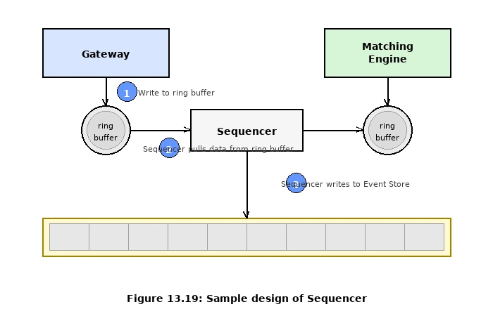

高階設計中的 Sequencer 同時扮演三個角色：message queue、event store、sequence numbering。功能複雜，相對較慢。

Event Sourcing 架構中，Event Store 本身就是持久化層，Sequencer **只剩一個職責**：

> **在事件寫入 Event Store 之前，注入嚴格遞增的 Sequence ID。**

這讓 Sequencer 變得極度精簡，只做一件事，速度因此更快。

**為什麼每個 Event Store 只能有一個 Sequencer？**

若多個 Sequencer 同時寫入，它們會搶奪寫入權（Lock Contention），並且無法保證序列號的全域遞增順序。Exchange 這種高頻系統中，Lock Contention 是致命的延遲來源。因此強制規定：**單一 Writer（Sequencer）是 Event Store 不可妥協的原則**。

**備援定序器（Backup Sequencers）的高可用設計**

單一 Sequencer 是單點（Single Point of Failure）。書中明確指出，系統可以配置**備援定序器（Backup Sequencers）**：

- 平時只有一個 **Active Sequencer** 對 Event Store 進行寫入。
- 一個或多個 **Standby Sequencer** 處於熱備狀態，持續接收與 Active Sequencer 相同的輸入，但**不輸出**。
- 當 Active Sequencer 故障，Standby 接管後能從已知的最後序列號繼續遞增，保證序列號不中斷、不重複。

此設計與 Matching Engine 的 Hot-Warm 架構在原則上一致：**同一份事件流，備援節點同步消費但不輸出，故障時無縫接管**。

Sequencer 的具體做法（Figure 13.19）：

1. 各 Component 將事件先寫入自己本地的 **Ring Buffer**
2. Sequencer 從這些 Ring Buffer 拉取（pull）事件
3. 注入 Sequence ID 後寫入 Event Store（mmap）

---

### 高可用（Hot-Warm Architecture）


- **Hot Instance**：處理請求並向 Event Store 輸出成交結果。
- **Warm Instance**：同步消費 Event Store 的 `NewOrderEvent`，在記憶體中維護相同狀態，但**不輸出任何結果**。
- **故障偵測**：Hot Instance 定期發送 Heartbeat；Warm Instance 超時未收到則觸發 Failover 流程。

**跨機器 / 跨資料中心**：整台 Server（含整個 Event Store）作為 Hot 或 Warm 單元。使用 **Reliable UDP（如 Aeron 框架）** 廣播 Event Store 的新事件到所有 Warm Server。

---

### Fault Tolerance（容錯性）

Hot-Warm 解決大多數情況，但需回答四個關鍵問題：

1. 主節點掛掉時，**何時** Failover？
2. **如何選出** 新 Leader？
3. **RTO（Recovery Time Objective）**：允許停機多久？
4. **RPO（Recovery Point Objective）**：允許損失多少資料？

#### Failover 決策的難題

| 問題                            | 說明                                                       |
| :------------------------------ | :--------------------------------------------------------- |
| **假陽性（False Alarm）** | 誤判主節點故障，不必要的 Failover 反而中斷服務             |
| **Bug 連鎖故障**          | 相同 Bug 同時擊潰主節點和備援節點，Failover 後立即再次崩潰 |

建議：新系統初期採**手動 Failover**，累積 Operational Experience 後再自動化；配合 **Chaos Engineering（混沌工程）** 主動注入故障，加速驗證系統行為。

#### Raft 演算法選主（Figure 13.21、13.22）


使用 **Raft** 管理節點，以 5 個節點的 cluster 為例：

- 最少需要 $\frac{5}{2} + 1 = 3$ 票才能完成操作（過半數）
- Leader 透過 **AppendEntries RPC** 將事件複製到所有 Followers 的 mmap Event Store
- Leader 定期發送 **Heartbeat**（空的 AppendEntries）
- Follower 超過 election timeout 未收到 Heartbeat → 成為 Candidate 並發起 RequestVote
- 若多個 Follower 同時選舉造成 **Split Vote** → election timeout 後重新選舉

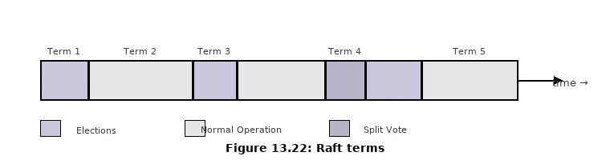

**Raft Term**：時間切分為任意長度的 Term，包含 Election 期和 Normal Operation 期，Term 號碼防止過期候選人當選。

#### RTO 與 RPO

| 指標          | 定義                   | 交易所要求                        |
| :------------ | :--------------------- | :-------------------------------- |
| **RTO** | 可容忍的最長停機時間   | **秒級**（需自動 Failover） |
| **RPO** | 可容忍的最大資料遺失量 | **近零**（Raft 多副本保證） |

---

### Matching Algorithms（撮合算法）

核心邏輯 Pseudocode：

```
handleOrder(orderBook, orderEvent):
  if orderEvent.sequenceId != nextSequence → Error(OUT_OF_ORDER)
  if !validateOrder(symbol, price, quantity) → Error(INVALID_ORDER)
  order = createOrderFromEvent(orderEvent)
  switch msgType:
    NEW    → handleNew(orderBook, order)
    CANCEL → handleCancel(orderBook, order)

handleNew(orderBook, order):
  if order.side == BUY → match(orderBook.sellBook, order)
  else                 → match(orderBook.buyBook, order)

handleCancel(orderBook, order):
  if orderId not in orderBook.orderMap → Error(CANNOT_CANCEL_ALREADY_MATCHED)
  removeOrder(order); setStatus(CANCELED)
  return Success(CANCEL_SUCCESS)

match(book, order):
  leavesQty = order.quantity - order.matchedQuantity
  iter = book.limitMap.get(order.price).orders   // FIFO queue
  while iter.hasNext() && leavesQty > 0:
    matched = min(iter.next().quantity, leavesQty)
    order.matchedQuantity += matched
    leavesQty = order.quantity - order.matchedQuantity
    remove(iter.next()); generateMatchedFill()
  return Success(MATCH_SUCCESS)
```

#### 常見撮合算法

| 算法                                      | 說明                                               | 使用場景         |
| :---------------------------------------- | :------------------------------------------------- | :--------------- |
| **FIFO（Price-Time Priority）**     | 相同價格下，先掛單者先成交                         | 大多數股票交易所 |
| **FIFO + LMM（Lead Market Maker）** | 造市商依協議比例優先獲分配，其餘按 FIFO            | 期貨市場         |
| **Dark Pool（暗盤）**               | 委託簿不公開，大額機構訂單在不影響市場的情況下撮合 | 法人機構         |

---

### Determinism（決定性）

#### 1. Functional Determinism（功能決定性）

給定相同的事件輸入序列，必定產生相同輸出。Sequencer + Event Sourcing 共同保證。事件的**絕對時間戳不重要，只有順序重要**——重播時，時間軸上原本離散不均的事件被壓縮為連續緊密的序列，Recovery 速度大幅提升。

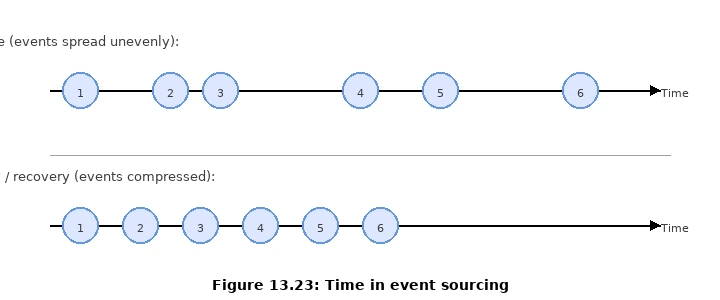

#### 2. Latency Determinism（延遲決定性）

每筆交易的延遲應高度一致，避免少數交易的延遲爆炸影響用戶體驗：

- **P99 / P99.99 延遲**：比平均值更能反映真實體驗
- 工具：**HdrHistogram（High Dynamic Range Histogram）**，精確記錄微秒級延遲分布

**常見的延遲殺手**：Java HotSpot JVM 的 **Stop-the-World GC** 會暫停所有 Thread 數毫秒，導致 P99.99 延遲飆升。這是交易所傾向使用 **C++** 或採用 GC-free 方案的主要原因。

---

### Market Data Publisher 優化

#### Ring Buffer 取代動態記憶體（Figure 13.24）

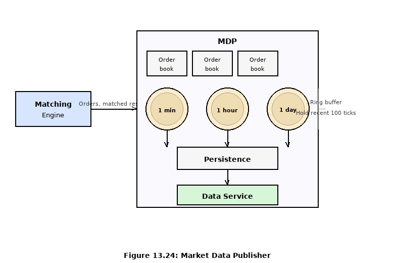

MDP 使用 **Ring Buffer（循環緩衝區）** 儲存 Candlestick 數據，例如保存最近 **100 ticks**：

- **固定大小**：預先分配記憶體，無動態 `new` / `delete`，避免 GC 壓力
- **Lock-free**：單 Producer 多 Consumer 結構不需要鎖
- **進階優化**：Padding（填充）確保 Ring Buffer 的 sequence number 不與其他數據共享 CPU Cache Line，避免 **False Sharing**

**K 線圖的記憶體管理策略（兩段式）**

追蹤大量股票（如數千檔）乘上多個時間維度（1m、5m、1h、1d）的 K 線，記憶體需求會快速膨脹。書中提出配套的兩段式策略：

1. **Ring Buffer 限制記憶體中的 K 線數量**：每個（symbol × resolution）組合只在 Ring Buffer 中保留固定筆數（如最近 100 根 K 線）。這保證記憶體上限可預測、可控。
2. **超出上限的舊資料持久化至磁碟（Persist to disk）**：當 Ring Buffer 滿後，最舊的 K 線會被寫出到磁碟（或歷史資料庫），釋放 Ring Buffer 空間供新 K 線使用。

這樣設計的結果是：**熱數據（近期 K 線）在記憶體中以微秒速度存取；冷數據（歷史 K 線）在磁碟上按需讀取**，兩者各司其職，互不干擾。

#### L2 數據付費等級

L2 訂單簿深度也是商業模式的一部分：

- 零售客戶：預設只看 **5 個價格檔位**
- 付費升級：可看 **10 個或更多**檔位

---

### Market Data 公平性與 Multicast

#### 不公平問題

MDP 對訂閱者依序發送，**先訂閱的先收到數據**。聰明的客戶會搶在開盤前訂閱，形成速度競賽（Race to Subscribe），破壞市場公平性。

#### 解決方案：Reliable UDP Multicast

資料傳輸三種模式：

| 模式                | 說明                             |
| :------------------ | :------------------------------- |
| **Unicast**   | 一對一，點對點                   |
| **Broadcast** | 廣播到整個子網路                 |
| **Multicast** | 廣播到特定多播群組（可跨子網路） |

交易所採用 **Reliable UDP Multicast** 同時將市場數據推送給所有訂閱者，理論上所有人同一時間收到相同數據：

- UDP 本身不可靠（封包可能遺失），需額外的**重傳機制（Retransmission）**
- 輔助做法：MDP 對訂閱者採**隨機排序**，讓先後順序優勢消失

---

### Colocation（機房共置）

許多交易所提供 **Colocation 服務**，允許 Broker / 對沖基金將伺服器實體放在交易所的資料中心：

- 延遲幾乎等於伺服器間電纜的光速傳播時間
- 不破壞市場公平性（任何人付費皆可使用）
- 可視為交易所的**付費 VIP 服務**

---

### Network Security / DDoS 防護

交易所對外有公開接口，DDoS 是真實威脅。五種防護技術：

1. **隔離公私服務**：DDoS 打公開服務時不影響機構客戶私有通道；相同數據可部署多份 **Read-only 副本**分散流量。
2. **Cache 層**：對不常更新的數據加 Cache，大多數查詢不打到後端資料庫。
3. **URL 設計防範**：

   - ❌ `GET /data?from=123&to=456`（Query String 可無限組合，難以快取）
   - ✅ `GET /data/recent`（路徑固定，可在 CDN 層快取）
4. **Safelist / Blocklist**：網路 Gateway 產品通常內建，封鎖惡意 IP 或僅允許白名單進入。
5. **Rate Limiting（限流）**：Client Gateway 對每個 IP / 帳號設定請求上限，防止單點過載。

---

## 總結與延伸思考

1. **Sequencer 瓶頸** ：雖然是單點，但因只做簡單編號與持久化，吞吐量極高，通常不是瓶頸。
2. **為什麼不用 Kafka** ：Kafka 對於交易所這類微秒級延遲要求的場景來說，網路開銷與內部的 Batch 機制太慢。
3. **Trade-off** ：CPU Pinning 會導致 CPU 即使在沒單時也 100% 運作（Busy Wait），但在極低延遲系統中，這比中斷處理更值得。
4. **現代變化** ：加密貨幣交易所多運行於雲端，雖然延遲較高，但進入門檻低；DeFi 則使用 AMM（自動造市）演算法取代 Order Book。

---

 **參考書目** ：*System Design Interview — An Insider's Guide, Volume 2, Chapter 13*
