# 系統設計讀書會｜Ch.13 股票交易所 — 40 分鐘分享腳本

> 根據《System Design Interview Vol.2》第 13 章整理，適合讀書會主講人逐段使用。
> 每段標有預估時間，全場合計約 40 分鐘。

---

## 開場白（2 分鐘）

> 「今天我們挑戰一個難度最高的系統設計題之一——**電子股票交易所**。它有多難？NYSE 每天撮合數十億筆交易，HKEX 每日交易量高達 2,000 億股。這個系統對延遲的要求是**毫秒等級**，可用性要求 99.99%，容錯要求秒級切換。這不是普通的 CRUD 系統——它迫使我們去思考電腦科學的極限。」

---

## Part 1 — 認識問題 ⏱ 5 分鐘

### 1.1 問對問題（Step 1 訪談模擬）

先帶大家感受面試時的對話節奏。這章的格式是 Candidate / Interviewer 對話，直接模擬真實面試：

| 問題 | 答案（範圍設定）|
|---|---|
| 交易哪些品種？ | 只做股票，不含期貨 / 選擇權 |
| 支援哪些操作？ | 新增委託（Place）、取消委託（Cancel），限價單 |
| 規模？ | 同時在線數萬用戶、100 支股票、每日數十億筆 |
| 風控？ | 單日交易上限（如 Apple 股每天最多 100 萬股）|
| 錢包管理？ | 下單需凍結資金，防止超買 |

**重點提示：** 交易所面試題的關鍵是**主動問清楚邊界**。問題本身就是答案的一部分。

### 1.2 非功能性需求（4 項）

```
可用性   → 99.99% = 每天最多 8.64 秒停機
延遲     → P99 毫秒等級（從訂單進場到回傳 Fill）
容錯性   → 快速偵測故障 + 秒級切換
安全性   → KYC + DDoS 防護
```

**延遲的精確定義：** 計算起點是市價單進入交易所那一刻，終點是該訂單作為已完成的執行結果回傳。此定義用於實務基準測試，確保量測範圍不含網路傳輸至券商的部分。

### 1.3 規模估算（Back-of-Envelope）

```
交易時段：6.5 hr = 23,400 sec
每日訂單：10 億筆

平均 QPS = 1,000,000,000 / 23,400 ≈ 43,000
峰值 QPS = 43,000 × 5 = 215,000
```

**為什麼乘以 5？** 開收盤前後 15 分鐘通常消耗當日 30-50% 交易量，重大新聞時流量瞬間暴漲。215K QPS 已是單台伺服器的極限邊界。

---

## Part 2 — 高階設計：三條資料流 ⏱ 8 分鐘

### 2.1 系統全圖（Figure 13.6）

整個交易所有**三條資料流**，分別有不同的延遲要求：

```
① Trading Flow（交易流）      →  關鍵路徑，毫秒等級
② Market Data Flow（市場資料流）→  非同步，廣播導向
③ Reporting Flow（報告流）     →  非即時，準確性優先
```

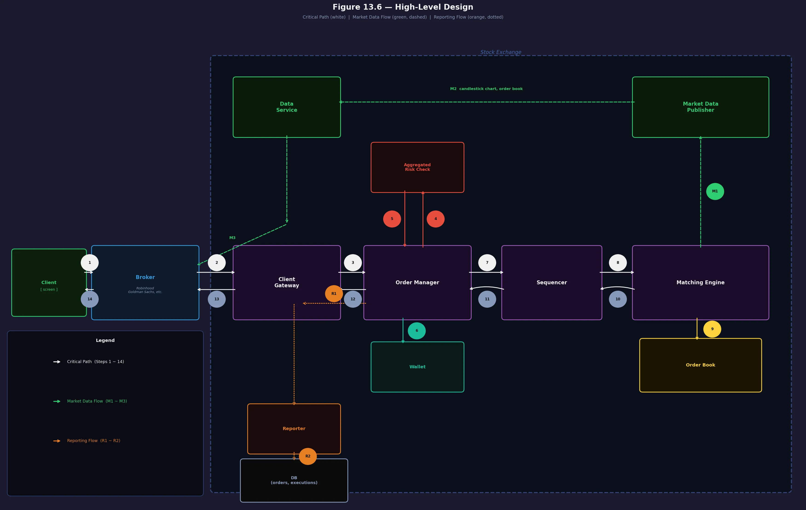

### 2.2 Trading Flow（逐步追蹤 Steps 1–14）

帶大家走一遍訂單的生命週期：

```
Step 1-2：客戶透過 Broker 下單
Step 3  ：Client Gateway（認證、限流、協議轉換）
Step 4-5：Risk Check（風險檢查，e.g., 日交易額 < 100萬）
Step 6  ：Wallet 確認資金並凍結
Step 7-8：Sequencer 打上序列號
Step 9  ：Matching Engine 撮合（一對成交 → 兩筆 Fill）
Step 10-14：結果原路回傳給客戶
```

**關鍵洞察：** Sequencer 不只是產生 ID，它是一個**事件儲存（Event Store）**，讓整個系統可以 replay 重建狀態。

### 2.3 Market Data Flow（M1–M3）

```
M1：Matching Engine → Market Data Publisher（MDP）
M2：MDP 重建 Order Book + K 線圖（Candlestick Chart）
M3：Data Service 廣播給 Broker → 使用者看到即時股價
```

### 2.4 Reporting Flow（R1–R2）

```
Reporter 收集 Orders + Executions
→ 寫入 DB（合規用途：清算、稅務、歷史查詢）
```

不在關鍵路徑上，不影響交易速度，但對合規與對帳至關重要。

---

## Part 3 — 業務知識補充（Business Knowledge 101）⏱ 4 分鐘

### 3.1 客戶類型差異

| 類型 | 代表 | 需求 |
|---|---|---|
| **Retail（散戶）** | Robinhood 用戶 | 友善介面、HTTP OK |
| **Institutional（機構）** | 退休基金、大型券商 | 大量訂單、order splitting |
| **HFT / 造市商** | 對沖基金 | **超低延遲、Colo Engine** |

### 3.2 市場數據三層（L1 / L2 / L3）

用 Apple 股票舉例：

```
L1 → Best Bid: $100.08 (2000股) / Best Ask: $100.10 (1800股)
L2 → 多個價格檔位的總量（市場深度）
L3 → 每一筆獨立委託單的明細（只給造市商看）
```

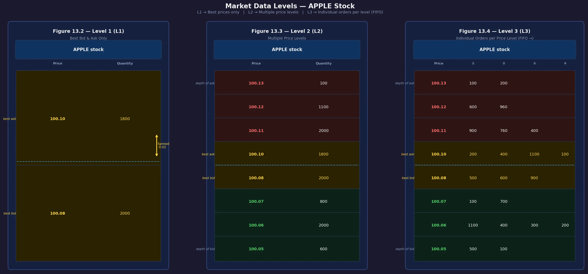

| 層級 | 顯示資訊 | 主要使用者 | 系統複雜度 |
|---|---|---|---|
| **L1** | 僅限 Best Bid/Ask | 一般大眾、散戶 | 低（數據量最小）|
| **L2** | 多個價格檔位總量 | 專業交易者、當沖客 | 中（需聚合訂單）|
| **L3** | 每一筆獨立委託明細 | 造市商、機構 | 高（需處理所有事件）|

**設計含義：** 支援 L3 需要處理所有訂單事件，吞吐量需求最高。

### 3.3 FIX Protocol

金融業標準訊息格式（1991 年創建）。範例：

```
8=FIX.4.2 | 9=176 | 35=8 | 49=PHLX | 55=MSFT | 54=1 | 44=15 ...
```

FIX 解析慢，Gateway 會轉成 **SBE（Simple Binary Encoding）** 後才進入交易域。

### 3.4 Client Gateway 三種類型（Figure 13.9）

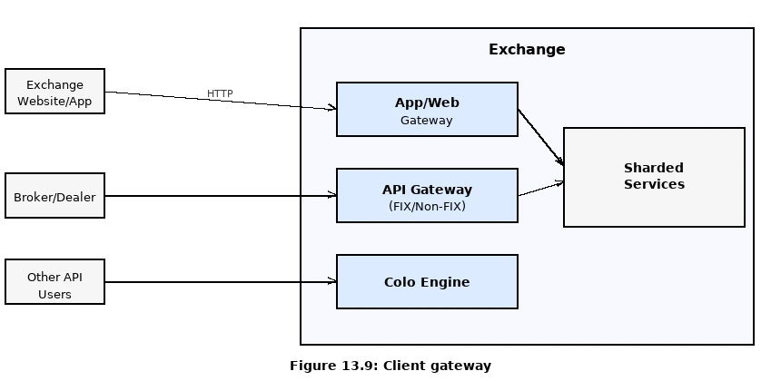

| 類型 | 使用者 | 協議 | 延遲特性 |
|---|---|---|---|
| **App/Web Gateway** | 一般散戶 | HTTP/WebSocket | 毫秒可接受 |
| **API Gateway (FIX)** | Broker / Dealer | FIX 或自訂 Binary | 低延遲 |
| **Colo Engine** | 對沖基金、造市商 | 自定義 Binary | 光速等級 |

**Colo Engine** 是終極低延遲方案：券商將伺服器實體放入交易所機房，延遲等於光走銅線的時間。合法的付費 VIP 服務。

---

## Part 4 — Order Book 資料結構 ⏱ 7 分鐘

### 4.1 Order Book 的操作需求

核心資料結構，必須滿足：

```
① 常數時間查詢（某價位的總量）
② O(1) 新增 / 取消 / 成交
③ 快速取得 Best Bid / Best Ask
④ 遍歷各價位
```

### 4.2 資料結構設計（Figure 13.14）

書中給出精妙的組合設計：

```
OrderBook
├── BuyBook  (HashMap<Price, PriceLevel>)
├── SellBook (HashMap<Price, PriceLevel>)
├── bestBid / bestOffer (PriceLevel)
└── OrderMap (HashMap<OrderID, Order>)   ← O(1) 取消的關鍵

PriceLevel
├── limitPrice
├── totalVolume
└── orders: DoubleLinkedList<Order>      ← O(1) 新增/移除
```

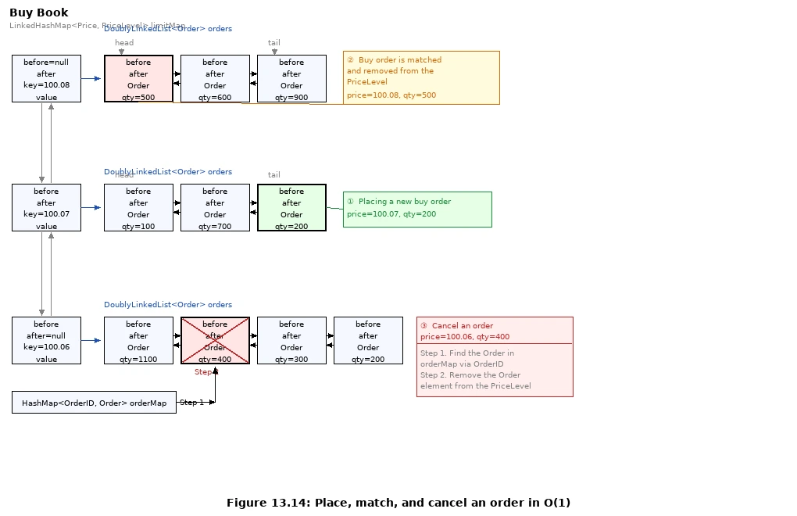

**為什麼用雙向鏈結串列？**

| 操作 | 方式 | 複雜度 |
|---|---|---|
| 新增訂單 | 加到 tail | O(1) |
| 成交（FIFO）| 從 head 移除 | O(1) |
| 取消訂單 | OrderMap 找節點 + 雙向指標刪除 | O(1) |

### 4.3 成交範例（Figure 13.13）

一筆買入 2700 股的大單進來：

```
Best Ask 100.10: [200, 400, 1100, 100] → 全部吃掉 1800 股
100.11: [900, 700, 400] → 吃掉最前面的 900 股
2700 - 1800 - 900 = 0，全部成交

成交後：Best Ask 提升到 100.11，bid/ask 價差擴大
```

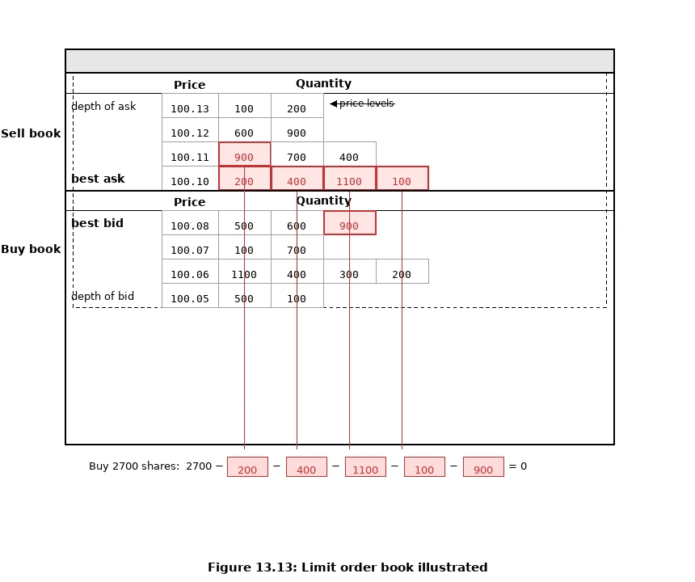

---

## Part 5 — Deep Dive：效能架構 ⏱ 7 分鐘

### 5.1 為什麼傳統架構不夠快？

```
網路延遲：每次 hop ≈ 500 微秒
多個元件透過網路溝通 → 累計到毫秒甚至數十毫秒
磁碟寫入：即使順序寫，也是數十毫秒等級

Critical Path: gateway → order manager → sequencer → matching engine
```

### 5.2 解法：把所有東西塞進一台伺服器（Figure 13.15）

```
┌─────────────────────────────────────────────┐
│              One Single Server              │
│  ┌──────────┐  ┌──────────┐  ┌───────────┐  │
│  │Order Mgr │  │ Matching │  │Market Data│  │
│  │App Loop  │  │ Engine   │  │Publisher  │  │
│  └──────────┘  └──────────┘  └───────────┘  │
│            ↕ mmap（共享記憶體）              │
│  Reporter │ Logging │ Risk Check │ Position  │
└─────────────────────────────────────────────┘
```

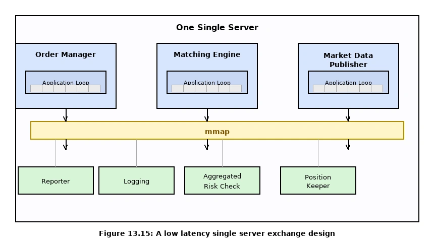

### 5.3 三個關鍵技術

**① Application Loop（應用程式輪詢）**

- 每個元件是一個獨立 Process，以 while loop 持續輪詢任務
- 主執行緒**釘死在一個 CPU 核心（CPU Pinning）**
- 好處：零 Context Switch、零鎖競爭 → 低且穩定的 P99 延遲

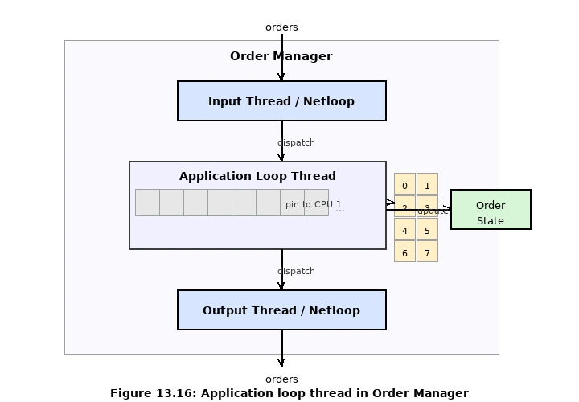

**② mmap（記憶體映射）**

- `mmap(2)` 系統呼叫 + `/dev/shm`（記憶體磁碟）
- 元件間溝通無需網路 / 磁碟
- 傳送一條訊息 < 1 微秒（sub-microsecond）
- 本質：以 mmap event store 取代 Kafka，在嚴格延遲需求下效能更可預測

**③ Ring Buffer（環形緩衝區）**

- 固定大小、Lock-free、無動態記憶體分配
- 用於 MDP 的 Candlestick Chart 記憶體管理，保留最近 N 根 K 線
- Sequencer 也透過 Ring Buffer 從各元件拉取事件

---

## Part 6 — Event Sourcing 事件溯源 ⏱ 5 分鐘

### 6.1 傳統 vs 事件溯源（Figure 13.17）

```
傳統方式（資料庫）：
  Order Table: V1=New → V2=Filled
  問題：只知道現在的狀態，不知道「怎麼來的」

事件溯源：
  Event Log: [seq=100, NewOrderEvent], [seq=101, OrderFilledEvent]
  優點：可以 Replay 任何歷史時間點的狀態，且保證確定性
```

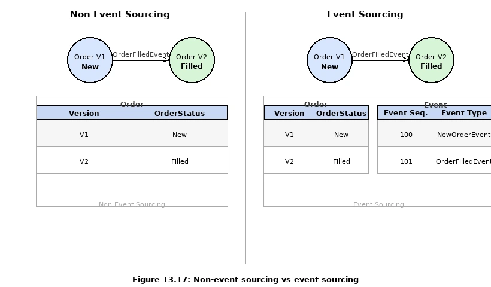

### 6.2 Event Store 設計（Figure 13.18 / 13.19）

```
Gateway     → 寫入 Ring Buffer（本地）
Sequencer   → 從各元件 Ring Buffer 拉取 → 打上 Sequence ID → 寫入 Event Store (mmap)
Matching Engine → 從 Event Store 讀取 → 處理 → 產生 OrderFilledEvent → 寫回 Event Store
Reporter / MDP  → 訂閱 Event Store → 各自處理
```

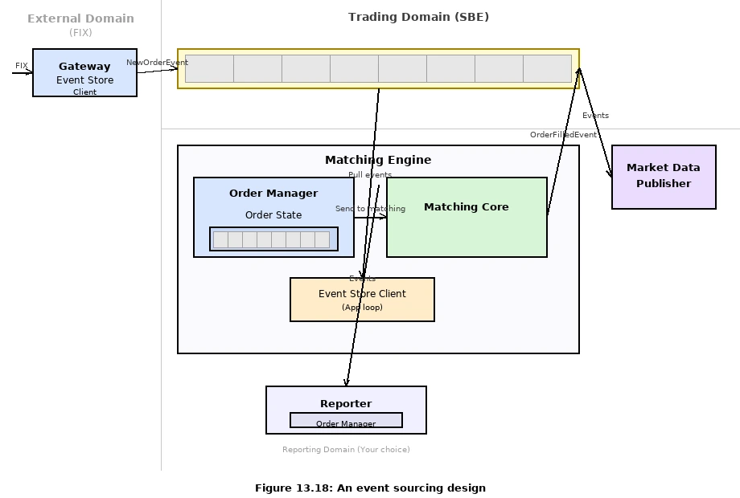

**Sequencer 的核心設計原則：只能有一個 Writer！**

多個 Writer 搶著寫 → 鎖競爭 → 延遲不可預測。Sequencer 是單一寫入者，速度極快，並可設置備援 Sequencer 確保高可用。

---

## Part 7 — 高可用與容錯 ⏱ 5 分鐘

### 7.1 Hot-Warm 架構（Figure 13.20）

```
Hot（主要）Matching Engine
  → 正常處理，產生 OrderFilledEvent，對外輸出

Warm（備援）Matching Engine
  → 接收相同 NewOrderEvent，靜默跟隨（不對外輸出）

當 Hot 失效 → Warm 立即接手（狀態完全同步）
Warm 重啟  → 從 Event Store Replay 即可還原
```

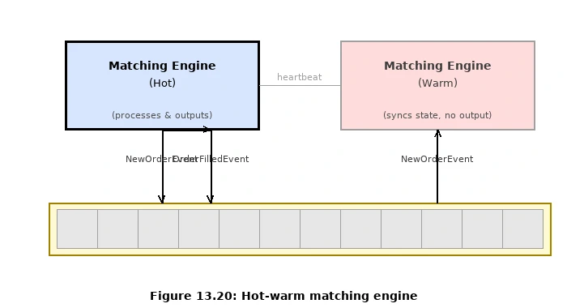

**Event Sourcing 的最大優勢體現於此：** 狀態可重建，Replay 本身就是恢復機制。

### 7.2 跨機器容錯：Raft 共識算法（Figure 13.21–22）

單台伺服器的 Hot-Warm 無法抵抗資料中心故障，需要跨機器複製：

```
5 台 Server 組成 Raft Cluster
需要 ⌊5/2⌋ + 1 = 3 票才能完成操作

Leader 透過 AppendEntries RPC 將 Event Store 複製給所有 Follower
Leader 失聯 → Follower 觸發選舉 → 新 Leader 在秒級內產生
```

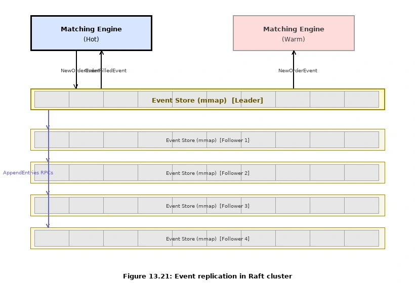

| 指標 | 目標 |
|---|---|
| **RTO**（Recovery Time Objective）| 秒級 |
| **RPO**（Recovery Point Objective）| ≈ 0（Raft 保證無資料遺失）|

**容錯設計的難題：**
1. 系統可能送出假警報，導致不必要的 Failover
2. 程式 Bug 可能讓主備都同時掛掉

建議：先上線時手動 Failover，積累足夠信心後再自動化；搭配 Chaos Engineering 加速磨練。

---

## Part 8 — 其他有趣主題 ⏱ 3 分鐘

### 8.1 市場資料公平性 + Multicast

**問題：** MDP 的訂閱者列表若照連線順序排列，聰明的客戶會搶著在開盤前連線，率先收到資料獲得優勢。

**解法：**
1. **UDP Multicast** — 同一個 Multicast Group 內，所有訂閱者「理論上」同時收到
2. 訂閱者列表以隨機順序排列

注意：UDP 是不可靠協議，需要有重傳機制（Reliable UDP）。

### 8.2 Colocation（機房共置）

機構投資者花錢把自己的伺服器放進交易所機房 → 延遲等於光走銅線的時間。**合法的付費 VIP 服務，不違反公平性原則。**

### 8.3 DDoS 防護

```
① 公開服務與私有服務隔離
② 頻繁查詢的資料加 Cache（避免打到 DB）
③ URL 設計不含動態 Query String（CDN 可快取）
   好：/data/recent
   壞：/data?from=123&to=456（每次 URL 不同，無法快取）
④ Safelist / Blocklist 機制
⑤ Rate Limiting
```

---

## Part 9 — 撮合算法快速掃描 ⏱ 2 分鐘

書中提供的虛擬碼展示了 **FIFO 撮合**（先進先出）：

```pseudocode
handleNew(orderBook, order):
  if BUY  → match(sellBook, order)
  if SELL → match(buyBook, order)

match(book, order):
  while 還有剩餘量 and 還有對手單:
    matched = min(對手單量, 剩餘量)
    generateMatchedFill()
    remove 對手單
  return SUCCESS
```

**其他常見算法（期貨市場）：**

| 算法 | 說明 |
|---|---|
| **FIFO** | 同價位先到先得，最常見 |
| **FIFO with LMM** | 造市商享有優先分配額度（需付費談判）|
| **Dark Pool** | 大型機構匿名交易，不揭露訂單明細 |

---

## Wrap Up 與討論 ⏱ 3 分鐘

### 本章核心架構決策總結

| 挑戰 | 設計決策 | 代價 |
|---|---|---|
| 超低延遲 | 所有元件在同一伺服器 + mmap | 水平擴展困難 |
| 狀態可復原 | Event Sourcing + Sequencer | 設計複雜度提升 |
| 零 GC 停頓 | Ring Buffer，避免動態記憶體分配 | 需 C++/Go，工程難度高 |
| 公平性 | UDP Multicast + 隨機排序 | UDP 不可靠，需重傳機制 |
| 跨機房容錯 | Raft Consensus（5 節點）| 引入選舉延遲 |

### 討論問題

1. **為什麼大型交易所選擇單台巨型伺服器，而不是微服務？**
2. **Sequencer 是單點故障嗎？怎麼解決？**（提示：Ring Buffer + Backup Sequencer）
3. **你覺得加密貨幣交易所（如 Binance）和傳統交易所最大的架構差異是什麼？**（提示：書末提到 AMM 不需要 Order Book）

---

## 章節全景心智圖

```
Stock Exchange
├── Step 1: 需求
│   ├── 非功能: 99.99% / 容錯 / 毫秒延遲 / 安全
│   └── 估算: 100 symbols / 215k 峰值 QPS
├── Step 2: 高階設計
│   ├── 三流: Trading / Market Data / Reporting
│   ├── API: Order / Execution / OrderBook / Candles
│   └── 資料模型: Product-Order-Execution / OrderBook / Candlestick
└── Step 3: Deep Dive
    ├── 效能: 單伺服器 + mmap + CPU Pinning + Ring Buffer
    ├── Event Sourcing + Sequencer（單一 Writer）
    ├── 高可用: Hot-Warm Matching Engine
    ├── 容錯: Raft（5 節點，3 票決）
    ├── 撮合算法: FIFO
    ├── 確定性: Functional + Latency Determinism
    ├── MDP 優化: Ring Buffer for Candlestick
    ├── 公平性: Multicast + 隨機排序
    ├── Colocation: 合法付費低延遲服務
    └── 安全: DDoS 防護五招
```

---

> **延伸閱讀：**
> - [How to Build a Fast Limit Order Book](https://bit.ly/3ngMtEO)
> - [LMAX Disruptor（Ring Buffer 最佳實踐）](https://www.lmax.com/exchange)
> - [IEX「Flash Boys Exchange」公平性設計](https://en.wikipedia.org/wiki/IEX)
> - [Raft 共識算法](https://raft.github.io/)
> - [Latency Numbers Every Programmer Should Know](https://gist.github.com/jboner/2841832)
>
> **Lab 實作：** 本讀書會對應一個 Go 實作的 lab（`ch13_stock_exchange/`），用 Gin + Go channels 模擬 Ring Buffer，在單一 process 內串起完整的 API → Order Manager → Sequencer → Matching Engine → Market Data Publisher 管線，並附有 33 個單元測試與 k6 壓力測試。
