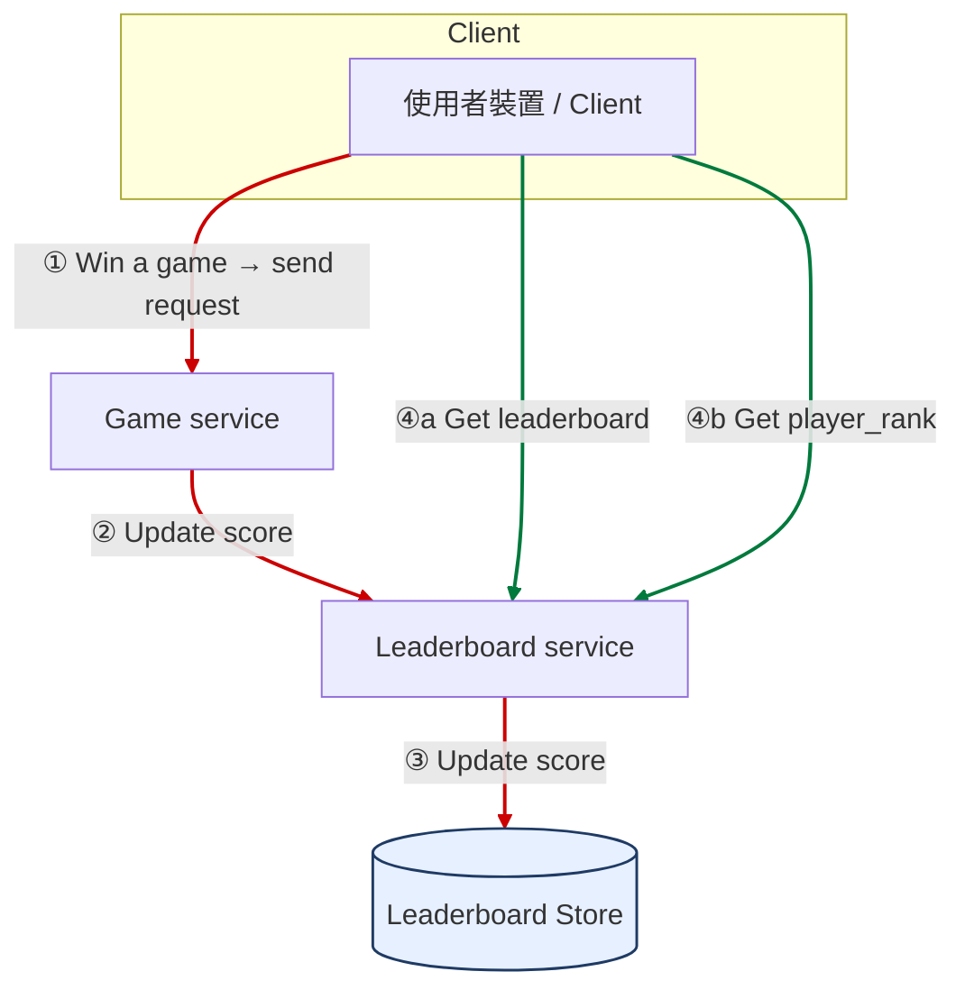
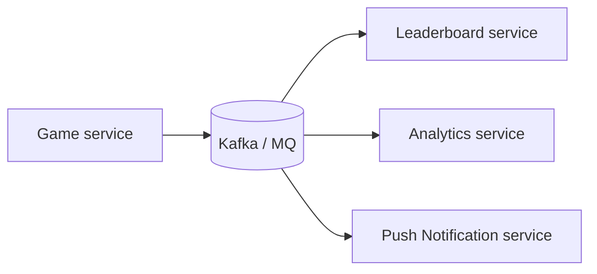

# Leader Board

# Leader Board

我們將設計一個**即時**遊戲排行榜系統

能參考 [Binance 的 leaderboard](https://www.binance.com/en/futures-activity/leaderboard/top-ranking) 。

## Step 1 : Requirements and Scope

> **Candidate:** How is the **score** calculated for the leaderboard?
> 
> **Interviewer:** The user gets a point when they win a match. We can go with a simple point system in which each user has a score associated with them. Each time the user wins a match, we should add a point to their total score.
> 
> 用戶在贏得一場比賽時會得到一點分數。我們可以採用一個簡單的積分系統，每個用戶都有一個與之相關聯的分數。每當用戶贏得一場比賽，我們就應該在他們的總分中增加一點。
> 
> **Candidate:** Are **all players** included in the leaderboard?
> 
> **Interviewer:** Yes.
> 
> **Candidate:** Is there a **time segment** associated with the leaderboard?
> 
> 排行榜是否有相關的時間分段（或賽季）？
> 
> **Interviewer:** Each month, a new tournament kicks off which starts a new leaderboard.
> 
> 每個月都會啟動一次新的錦標賽，並開始一個新的排行榜。
> 
> **Candidate:** Can we assume we only care about the **top 10 users**?
> 
> 我們是否可以假設我們只需要關心前 10 名用戶？
> 
> **Interviewer:** We want to display the top 10 users as well as the position of a specific user on the leaderboard. If time allows, let's also discuss how to return users **who are four places above and below a specific user**.
> 
> 我們想要顯示前 10 名用戶，以及特定用戶在排行榜上的位置。如果時間允許，我們也來討論如何回傳特定用戶排名上、下各四位的玩家。
> 
> **Candidate:** How many users are in a tournament?
> 
> **Interviewer:** Average of **5 million daily active users (DAU)** and **25 million monthly active users (MAU)**.
> 
> 平均有 500 萬每日活躍用戶 (DAU) 和 2,500 萬每月活躍用戶 (MAU)。
> 
> **Candidate:** How many matches are played on average during a tournament?
> 
> **Interviewer:** Each player plays **10 matches** per day on average.
> 
> 每位玩家平均每天進行 10 場比賽。
> 
> **Candidate:** How do we determine the rank if two players have the same score?
> 
> **Interviewer:** In this case, their ranks are the same. If time allows, we can talk about ways to break ties.
> 
> **Candidate:** Does the leaderboard need to be **real-time**?
> 
> **Interviewer:** Yes, we want to present real-time results, or as close as possible. It is not okay to present a batched history of results.
> 
> 是的，我們希望呈現即時的結果，或盡可能接近即時。呈現批次處理的歷史結果是不可接受的。

| **類型** | **項目** | **詳細要求** |
| --- | --- | --- |
| **功能需求 (F.R.)** | **排行榜顯示** | 1\. 顯示排行榜**前 10 名**玩家。 2. 顯示特定用戶的**當前排名**。 3. （加分項）顯示特定用戶**上下四個排名**的玩家。 |
| **非功能需求 (N.F.R.)** | **即時性 (Real-time)** | 積分更新必須**即時**反映在排行榜上，不接受延遲的結果。 |
| **比賽規則** | **計分方式** | 用戶每贏得一場比賽，總分加 **1** 點。 |
| **時間範圍** | **賽季長度** | 每個**月**開始一個新的錦標賽，即新的排行榜。 |
| **規模估算** | **每日活躍用戶 (DAU)** | 500 萬 (5M) 用戶。 |
| **規模估算** | **分數更新 QPS (峰值)** | 約 2,500 次/秒。 |

## User Scale

系統的規模假設：

每日活躍用戶 (DAU): 500 萬 (5 Million)

每月活躍用戶 (MAU): 2,500 萬 (25 Million)

## QPS estimate

QPS 估算決定了系統的**即時處理能力**。主要估算了兩種類型的 QPS：

#### A. Score Update QPS

指玩家贏得比賽後，系統需要更新分數的頻率。

| **項目** | **數量/假設** |
| --- | --- |
| **活躍用戶** | 5,000,000 DAU |
| **分數更新事件** | 假設每位 DAU **平均**每天贏得 1 場比賽（即 1 次分數更新）。 |
| **平均 QPS** | 5000000次更新/86400秒 = 57.87次/秒 |

為了設計具有冗餘和彈性的系統，設定了更高的 QPS 基準：

* **平均 QPS 基準：** 500 次/秒 (假設是更保守或更高的流量)
    
* **峰值 QPS 基準：** 2,500 次/秒 (假設是平均 QPS 基準的 5 倍)
    

> **🎯 思考：** 為什麼在設計一個**每月**都會重置的排行榜系統時，我們需要同時關注 **DAU (每日活躍用戶)** 和 **MAU (每月活躍用戶)**？哪一個數字對儲存**排行榜數據的總容量**影響最大？

#### B. Leaderboard Read QPS

這是指用戶查看前 10 名排行榜的頻率。

* **排行榜查詢 QPS：** 估計約 50 次/秒。
    

> **🎯 思考：** 如果我們必須在這兩項 QPS 中選擇一個來進行**優先優化**，你會選擇優化 **2,500 次/秒的「分數更新」** 還是 **50 次/秒的「排行榜查詢」**？為什麼？

## Step 2 : High-Level Design

## API Design

首先，系統必須定義外部服務和客戶端如何與排行榜系統互動。設計了三個核心 API：

| **API URI** | **方法** | **描述** | **呼叫方 (Caller)** | **Request Fields** | **Response Fields** |
| --- | --- | --- | --- | --- | --- |
| `/v1/scores` | `POST` | **更新用戶分數** (Score Update)（用戶贏得比賽時） | **遊戲服務器 (Game Service)** （*內部 API*） | `user_id` (string): 玩家唯一 ID `points` (integer): 要增加的分數（通常為 1） | `success` (boolean): 操作結果狀態 `new_score` (integer): 更新後的總分數 |
| `/v1/scores` | `GET` | **獲取排行榜前 10 名** (Get Top 10) | **客戶端 App (Client App)** | *無* | `leaderboard` (array):     包含多個物件，每個物件有：     `user_id` (string)     `score` (integer)     `rank` (integer) |
| `/v1/scores/{:user_id}` | `GET` | **獲取特定用戶排名** (Get User Rank) | **客戶端 App (Client App)** | *URI 參數*：     `user_id` (string) | `user_id` (string) `score` (integer): 玩家分數 `rank` (integer): 玩家排名 `neighbors` (array/optional):     該用戶**上下四位**玩家的列表。 |

**GET /v1/scores (獲取排行榜前 10 名)**

這個 API 用於獲取排行榜上分數最高的 N 個玩家（在此設計中為前 10 名）。

**API 目的：** 顯示完整的排行榜首頁。

```json
{
  "status": "success",
  "data": {
    "leaderboard": [
      {
        "user_id": "Aquaboys_976",
        "score": 976,
        "rank": 1
      },
      {
        "user_id": "B_team_956",
        "score": 956,
        "rank": 2
      },
      {
        "user_id": "Berlins_Angels_890",
        "score": 890,
        "rank": 3
      },
      {
        "user_id": "Grendel_Team_878",
        "score": 878,
        "rank": 4
      },
      // ... (省略中間部分)
      {
        "user_id": "Player_500",
        "score": 701,
        "rank": 9
      },
      {
        "user_id": "Last_Top_10",
        "score": 695,
        "rank": 10
      }
    ],
    "count": 10
  }
}
```

**GET /v1/scores/{:user\_id} (獲取特定用戶排名)**

這個 API 用於查詢特定用戶的個人資訊，並滿足額外需求：「顯示特定用戶**上下四個排名**的玩家」（即 `neighbors`）。

**API 目的：** 讓用戶快速找到自己的位置，並查看附近競爭者的分數。

假設查詢用戶：`user_id: CurrentPlayer_750`

```json
{
  "status": "success",
  "data": {
    "user_id": "CurrentPlayer_750",
    "score": 750,
    "rank": 1500, // 玩家當前的排名
    "neighbors": [
      // 玩家排名上方的四位 (Rank 1496 ~ 1499)
      {
        "user_id": "Rival_A",
        "score": 755,
        "rank": 1496
      },
      {
        "user_id": "Rival_B",
        "score": 754,
        "rank": 1497
      },
      {
        "user_id": "Rival_C",
        "score": 753,
        "rank": 1498
      },
      {
        "user_id": "Rival_D",
        "score": 752,
        "rank": 1499
      },
      // ********* 當前玩家 *********
      {
        "user_id": "CurrentPlayer_750",
        "score": 750,
        "rank": 1500,
        "is_current_user": true
      },
      // 玩家排名下方的四位 (Rank 1501 ~ 1504)
      {
        "user_id": "Friend_E",
        "score": 748,
        "rank": 1501
      },
      {
        "user_id": "Friend_F",
        "score": 745,
        "rank": 1502
      },
      {
        "user_id": "Friend_G",
        "score": 744,
        "rank": 1503
      },
      {
        "user_id": "Friend_H",
        "score": 743,
        "rank": 1504
      }
    ]
  }
}
```

## High-level Arch.

為了確保系統的**可擴展性**和**職責分離**，架構被劃分為兩個主要服務：

1. **遊戲服務 (Game Service)**：專注於遊戲本身的邏輯和驗證。
    
2. **排行榜服務 (Leaderboard Service)**：專注於管理和顯示分數與排名。
    

**運作流程：**

玩家贏得遊戲 → 遊戲服務驗證 → **調用排行榜服務 API** (`POST /v1/scores`) → 排行榜服務更新 **Leaderboard Store** 中的分數。



* **元件與分工**
    
    * **Client（使用者裝置）**：觸發遊戲結果上報，並向排行榜服務查詢資料。
        
    * **Game service**：接收「玩家贏得遊戲」的事件並進行必要驗證，之後請求排行榜服務更新分數。
        
    * **Leaderboard service**：提供更新與查詢排行榜的介面，對下游的 **Leaderboard Store** 進行資料存取。
        
    * **Leaderboard Store**：抽象的排行榜儲存層（圖中未指定技術或資料庫種類）。
        
* **寫入流程（①②③）**
    
    1. 玩家贏一場遊戲，**Client** 發請求給 **Game service**。
        
    2. **Game service** 確認結果有效後，呼叫 **Leaderboard service** 更新分數。
        
    3. **Leaderboard service** 將更新寫入 **Leaderboard Store**。
        
* **讀取流程（④a / ④b）**
    
    * **Client** 可**直接**呼叫 **Leaderboard service**：
        
        * ④a 取得排行榜（如 Top 10）。
            
        * ④b 查詢特定玩家在排行榜上的名次（player\_rank）。
            
    * **Leaderboard service** 從 **Leaderboard Store** 讀取並回傳查詢結果
        

### Do we need a **message queue** between the game service and the leader board service?

**是否需要要看「Game score event 會不會被多方使用」**。

* 若只是單純由 Leaderboard 讀取、沒有其他用途，**可直接同步呼叫** Leaderboard Service（不必加 MQ）（即更即時的變更）。
    
* 若同一份「分數更新事件」還要被 **多個服務** 消費（例如排行榜、分析、推播），**放進 Kafka 等 MQ 比較合適**，形成一對多的事件分發。
    



## Data Model & Storage Options

### 關聯式資料庫（Relational DB）方案

### 1️⃣ 基本設計

* 使用一張 `leaderboard` 表，欄位如下：
    
* | 欄位 | 型別 |
    | --- | --- |
    | user\_id | varchar |
    | score | int |
    
    每個月的排行榜可用一張表（或一個分區）表示。
    

### 2️⃣ 分數更新流程

當玩家贏得比賽時：

* 若該玩家尚未有紀錄 → 新增一筆：
    
* ```sql
          INSERT INTO leaderboard (user_id, score) VALUES ('mary1934', 1);
    ```
    
* 若已有紀錄 → 更新分數：
    
* ```sql
          UPDATE leaderboard SET score = score + 1 WHERE user_id = 'mary1934';
    ```
    

### 3️⃣ 查詢玩家名次

為了找出排行榜名次，必須根據分數排序：

```sql
SELECT (@rownum := @rownum + 1) AS rank, user_id, score
FROM leaderboard
ORDER BY score DESC;
```

### ⚠️ 問題點

* 當玩家很多（數百/千萬筆）時，排序操作非常耗時。
    
* SQL 排序與排名計算屬於 **掃描（scan）**, even `table scan`。
    
* 每次要查名次都必須對整張表排序 → 不適合即時系統。
    
* 若資料頻繁變動（玩家持續上分），無法依靠 cache/index。
    
* 只能做 batch job，不適合實時排行榜。
    

即使加上索引與 `LIMIT`（僅取前 N 名）仍無法從根本改善「找名次」問題。

#### RDB 中求特定玩家排名的 SQL

```sql
SELECT *,
    (SELECT COUNT(*) FROM leaderboard lb2 WHERE lb2.score >= lb1.score) AS rank
FROM leaderboard lb1
WHERE lb1.user_id = :user_id;
```

### 外層查詢 (`lb1`)

取出指定玩家的資料（例如 mary1934）。

### 🔹內層子查詢 (`lb2`)

計算所有分數「**大於等於該玩家分數**」的筆數。

也就是：

* 如果有 3 個人分數比她高或一樣高，
    
* 那她的名次（rank）就是第 3 名。
    

雖然邏輯簡單，但這查詢的問題在於：

**❗ 每次都執行一次完整的 COUNT(\*)**

對於每一位使用者，要重新掃描整張 leaderboard：

* 若有 100 萬玩家 → 需要執行 100 萬次 `COUNT(*)`。
    
* 每次 `COUNT(*)` 都會掃整個表（因為 `score >=` 無法使用索引完全優化）。
    

所以整體時間複雜度是：

> **O(N²)**（平方級別，非常慢）

**SQL 為何在這場景下無法快？**

* 關聯式資料庫（RDB）沒有內建「自動維持排序名次」的結構。
    
* `COUNT(*)` + `>=` 會導致資料庫必須掃描整個表。
    
* 即使加索引，也只能幫部分情況加速，仍需大量比較操作。
    

這就是為什麼書中說：

> SQL databases are not performant when we have to process large amounts of continuously changing information.

### Redis 方案

Redis 提供 **Sorted Set (ZSet)** 直接對應排行榜問題，在插入時就自動排序好，而且能直接用指令查名次：：

* 每個元素（玩家）都有一個「分數」。
    
* Redis 自動根據分數排序。
    
* 提供操作：
    
    * `ZINCRBY`：增加玩家分數。O(log n)
        
        * 每當玩家贏得一場比賽時，他的分數要加 1。`ZINCRBY <KEY> <INCREMENT> <USER>`
            
        * `ZINCRBY leaderboard_feb_2021 1 'mary1934'` ，在 `leaderboard_feb_2021`（2021 年 2 月排行榜）中，將使用者 `mary1934` 的分數增加 1。若她之前不在榜上，會自動新增。
            
        * 上個月的排行榜則會被移到歷史資料庫保存。因為 Redis 存在記憶體中，長期資料會定期清除或搬走。核心精神是 ***過往紀錄不會再被修改了***，放在關聯式資料庫以replica 跟 veiw 提供快速讀取。
            
    * `ZADD` : UPSERT 使用者與分數。O(log n)
        
    * `ZREVRANGE`：取得前 N 名。O(log n + m) ,**n** 是排行榜中總成員數量。**m** 是要取出的筆數（通常很小，例如前 10 名）。
        
        * `ZREVRANGE <KEY> <START> <STOP> WITHSCORES`
            
        * 取 Top 10 `ZREVRANGE` leaderboard\_feb\_2021 `0 9 WITHSCORES` 。`ZREVRANGE`：取出成員並依照分數**由高到低**排序（rev = reverse）。`WITHSCORES`：同時返回使用者分數。
            
        * 當月的 Top 10 用 Redis 這樣的解法比較快，因為 RDB 要全表排序才能得出結果。但過往的能另外做成一個存 Top 10 的 view.
            
        * 查詢附近名次，若 `Mallow007` 排名為 361，想看前後 4 名， `ZREVRANGE leaderboard_feb_2021 357 365` ，會返回 rank 357–365 的玩家清單。
            
    * `ZREVRANK`：查玩家名次 `ZREVRANK leaderboard mary1934`。O(log n)
        
        * `ZREVRANK <KEY> <USER>`
            
        * `ZREVRANK leaderboard_feb_2021 'mary1934'`
            

#### ZSet 內部實作：**Skip List（跳表）**

Redis Sorted Set 是用 **Skip List（跳表）** 實作的。

#### 概念：

類似「多層索引」的鏈結串列。

* 每一層會「跳過」一些節點，讓搜尋速度更快。
    
* 平均時間複雜度為 **O(log n)**，比全排序的 **O(n log n)** 快很多。
    
* 
    


* 當節點只有單層（Base list）→ 搜尋慢。
    
* 加入多層索引（Level 1, Level 2…）→ 能快速跳過大量節點。
    

舉例：搜尋節點 `45` 時，原本需走 8 步，

從 Level 1 開始走：

1️⃣ 1 → 8 → 15 → 36 → 60  
2️⃣ 發現 60 &gt; 45，就往下切換到底層。  
3️⃣ 從 36 繼續走到底層：36 → 45 ✅

👉 大概只花 6 步。

**再加更多層索引**

每一層都「再跳更遠」：

從 Level 2 開始走：

1️⃣ 1 → 15 → 60  
2️⃣ 發現 60 太大，往下一層 Level 1。。

3️⃣ 從 15 往後走：`15 → 36 → 60`  
4️⃣ 再往下層從 36 找：`36 → 45` ✅

👉 大概只花 6 步。

## Storage 需求

#### 記憶體估算

因為主要放 Redis ，那就要粗略估一下當月排行榜可能要多少記憶體來儲存。

最基本的情況下，排行榜需要儲存兩個欄位，user\_id 與 score

因此每個排行榜entry至少需要：

* `user_id`（假設為 24 bytes）
    
* `score`（16-bit 整數 = 2 bytes）
    

總共約 **26 bytes**。

最壞情況（worst-case scenario）

假設有 **2,500 萬月活躍使用者 (MAU)**，而每個人至少贏過一場比賽，  
因此每個人都會在排行榜中佔有一筆紀錄。大概需要 ≈ 650 MB

再加上 Redis 的 Index （skip list + hash table），  
記憶體需求約 **1.3 GB** 左右。

#### **效能負載**

CPU / I/O 考量：

估算每秒有約 2,500 次更新請求（**QPS 2500**），最基本的情況下，排行榜需要儲存兩個欄位

小 case!

#### Redis 的持久性問題 (Persistence Concern)

我們的需求量不高，基本一台主機提供讀寫即可，為此我們考慮**高可用**的情況下，通常會考慮做 **failover**。

* 啟用 **replication（主從複製）**：  
    主節點（master）處理寫入，  
    從節點（read replica）做備份與讀取。
    
* 若主節點故障，系統會自動將從節點升級成主節點。
    

雖然 Redis 有持久化機制（RDB / AOF），  
但從磁碟重啟大資料集仍然較慢，  
所以設計上會使用多副本來確保即時可用。

Redis 進行 **快照（snapshot / RDB dump）** 時，會使用 **Copy-on-Write（COW）** 機制：  
當 Redis 把記憶體內容寫入磁碟的同時，新的寫入仍在發生，這些新資料會暫存在新的記憶體區塊。

👉 所以在這段期間，**實際記憶體用量可能暫時翻倍**。

> 💡 範例：
> 
> * 排行榜原本需要 **1.3 GB** 記憶體
>     
> * 快照中寫入仍在進行
>     
> * 需要再額外預留 **1.3 GB**  
>     → 因此整體記憶體至少要準備 **2.6 GB**
>     

Redis 支援兩種持久化方式：

* **RDB**：定期快照（速度快，但可能遺失最近幾秒的資料）
    
* **AOF（Append Only File）**：逐筆記錄每次寫入（更安全但慢）
    

Redis 官方提供 [`redis-benchmark`](https://redis.io/docs/latest/operate/oss_and_stack/management/optimization/benchmarks/) 工具，用來模擬多用戶同時存取的情況。  
你可以用它測試：

* 每秒請求數（requests per second, RPS）
    
* 延遲（latency）
    
* 同時連線數（connections）
    

藉由這些數據，你可以判斷目前硬體配置（CPU、記憶體、網路）是否足以支撐你的排行榜負載。

#### 關聯式資料庫

Redis 處理排行榜的即時更新與查詢，  
但仍需要 **關聯式資料庫** 來保存永久性資料。

系統會設計兩張輔助表：

* User Table︰儲存 User profile
    
* Point Table︰儲存 play history(include user\_id, score, timestamp)。也能充當 redis 重建排行榜用的依據。
    
* 可以另外建立一個小型 view/cache ，專門存前十名玩家的詳細資料。因為這部分資料最常被查詢。且這不會佔用太多記憶體或儲存空間。
    

## TODO : Demo by K3D

**SLO**：更新/查詢 P95 &lt; 50ms；峰值 2,500 QPS 可撐。

場景 1 : Only RDBMS

* 先演示並解釋上述 SQL 的執行計畫
    
* 壓測腳本，並關注 dashboard
    

場景 2 : Use Redis

* 壓測腳本，並關注 dashboard 上的 duration
    

# 總結

## 先顧好的「小而關鍵」工程細節

* **冪等性**：`POST /v1/scores` 帶 `match_id`，服務端去重（避免重複加分）。
    
* **限流 & 防濫用**：在 Leaderboard Service 前做簡單令牌桶即可。
    
* **安全邊界**：只能由 Game Service 更新分數（client 不直寫）。
    
* **可觀測性**：QPS、P95 延遲、Redis 內存使用、慢查、鍵數量、複製延遲。
    
* **高可用但簡單**：主從複製（1 主 1 從）；RDB/AOF 擇一或混合；**記憶體預留 2×** 應對 COW snapshot。
    
* **月度滾榜**：`leaderboard_YYYYMM` 新鍵；歷史榜定期歸檔到 RDB（之後做離線報表/回放）。
    

## 什麼時候才引入複雜度（明確觸發點）

**1) 要不要 MQ（Kafka）？**  
只有當「**分數事件一對多**」被其他服務共用（風控/分析/推播/成就）時才加。

* 觸發點：新增第二個依賴「即時分數事件」的下游；或你需要**重播/審計**能力。
    
* 做法：Game Service 發 event → MQ → 多消費者（Leaderboard、Analytics…）。排行榜 path 仍可同步直寫，避免即時性被 MQ 拖慢。
    

**2) 要不要 Redis Cluster / Sharding？**  
當 **單節點**達到**兩類瓶頸**才升級：

* **容量**：單月榜含索引 &gt; 10–15GB，或多同時活躍榜單壓迫記憶體。
    
* **吞吐**：更新峰值逼近 **10萬+/秒**、或主從複製延遲持續飆高。  
    先考慮**固定分片**（依分數區間或區服/賽季），比 cluster 心智成本更低；真的全球級流量再上 **Redis Cluster**。
    

**3) 要不要 CQRS？**  
讀寫壓力/模型明顯分離、讀的花樣很多（多維排序、濾條件多）且你準備投入維運成本時再做。這題的讀模型單純（Top-N + 單人名次），**沒必要**。

## 風險與反模式（避免一開始就踩）

* **過度設計**：一上來就 Kafka、Cluster、CQRS，交付慢、故障面積大、Demo 不出來。
    
* **把歷史查詢放即時層**：舊榜查報表丟給 RDB/離線系統，別拖累 Redis。
    
* **客戶端直改分數**：安全洞；必須 server-authoritative。
    
* **忘了預留 2× 記憶體**：快照時 COW 會瞬時吃雙倍 RAM。
    
* **未做冪等/限流**：比「沒用 MQ」更容易把系統打爆。
    

## 我會在面試中強調的三句話

1. **先用最小架構打穿功能與即時性**：單台 Redis ZSet + MySQL 歷史表，三支 API 即可交付。
    
2. **明訂升級門檻與路徑**：多消費者上 MQ；容量/吞吐逼近單機上限再分片或 Cluster。
    
3. **工程實務先做對小事**：冪等等幂、限流、觀測、HA、月度滾榜與資料歸檔——這些比任何流行名詞更值錢。
    

# References

[https://medium.com/analytics-vidhya/redis-sorted-sets-explained-2d8b6302525](https://medium.com/analytics-vidhya/redis-sorted-sets-explained-2d8b6302525)

[https://systemdesign.one/leaderboard-system-design/](https://systemdesign.one/leaderboard-system-design/)